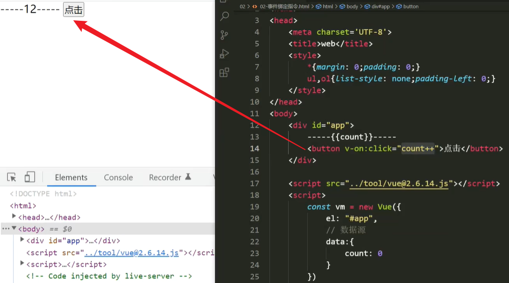
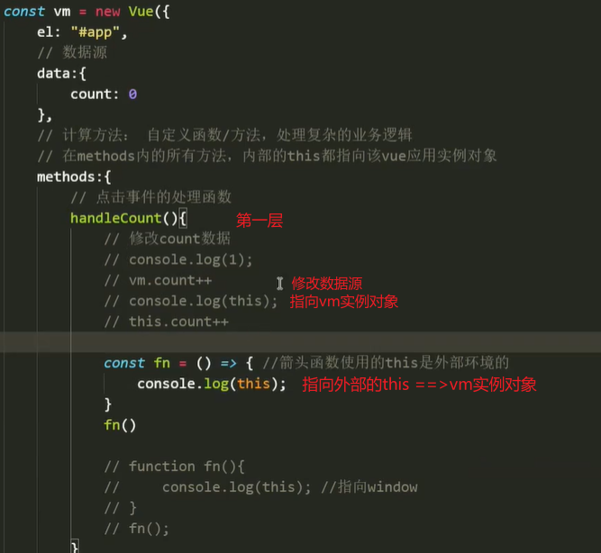
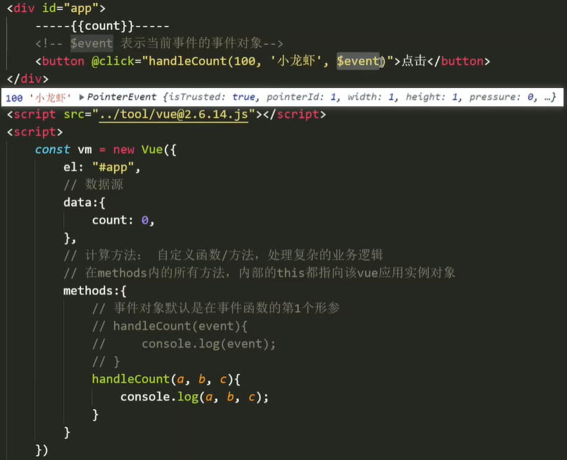
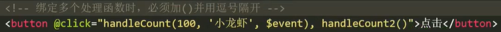
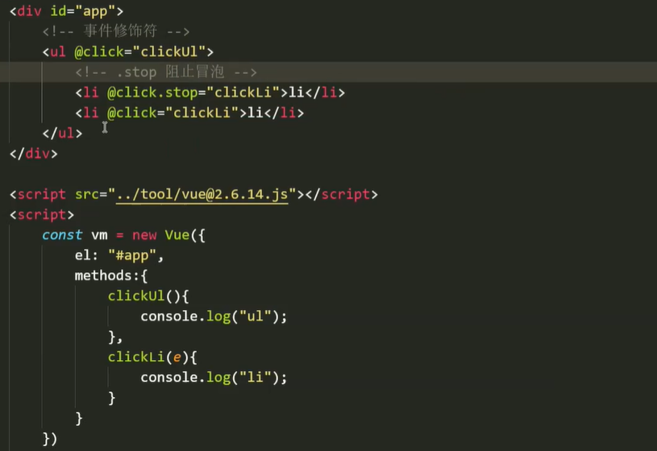
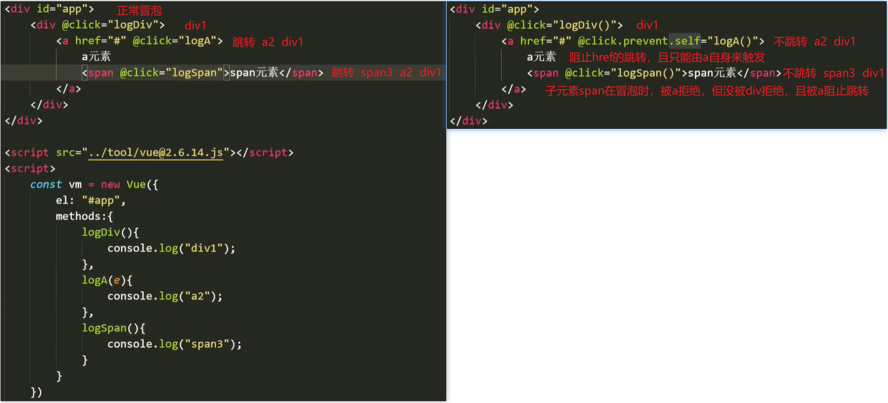
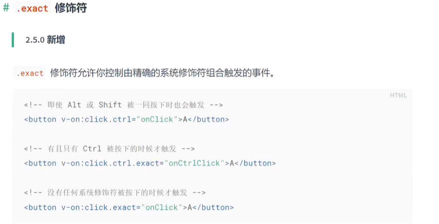

# 事件绑定指令

使用事件绑定指令`"v-on"`，为元素节点绑定指定事件。

使用方法：`原生 -- "onclick"` ；`vue -- "v-on:click"`

案例：简单表达式

 

### `methods`属性

若要为元素节点添加复杂的方法，则要使用`vm`的`methods`属性中提供的方法，如：`<button v-on:click = "handle()"></button>`

`methods`属性保存着所有`vm`可以提供使用的方法（`vm`方法集），它里面的写法支持`ES6`的语法。

注释：

- `methods`中第一层方法无需使用关键字声明，且内部的`this`指向当前的实例对象`vm`。
- 第二层方法采用原生`JS`的函数声明，普通函数内部的`this`指向默认的`window`。
- 在原生`JS`中，事件内部的`this`指向事件源的元素节点（谁触发指向谁）。

 

注意：

- 由于第二层方法默认指向`window`，不利于通过`this`来修改`data`中的数据。
- 因此，在`vue`的`methods`中第二层及以下的方法常使用箭头函数的方式来定义。
- 由于`"v-on"`指令经常使用，所以可简写为`"@"`，如：`v-on:click <==> @click`
- 使用`v-on`指令，可以在后面使用`[]`，让`vue`来提供事件名称，如：`@[ename] = "" // data : {ename : "click"}`

### 事件对象

`vue`并没有对事件对象`event`做修改，只是将使用的各种方法进行了提炼精简。

传参：

​		事件对象通常作为事件函数的第一个形参，而当要进行实参传递时，`vue`专为事件对象设置了一个实参变量`$event`。这个变量仅限于在事件绑定传参时使用。如：`<button @click = "handleCount($event, 'wanzi', 18)">点击</button>`

​         

##### 绑定二级 / 多个事件

可以直接在绑定的事件属性上添加多个事件处理函数，以逗号分隔且每个函数名后必须有`()`符号。

在使用`vue`的事件绑定指令时，函数名后面的`()`仅用作传参使用，不会立即执行函数。

 

在绑定多个事件处理函数时，不加`()`符号的函数，当该事件触发时不会被执行。

### 事件修饰符

原生操作事件对象的方法，在`vue`中可以通过使用事件修饰符更方便快捷地实现。即：给当前事件添加修饰。

使用方法：直接在需要修饰的事件名后面添加修饰符，即可调用提供的方法。可以连续添加多个。

##### 阻止冒泡【stop】

事件冒泡：当点击一个事件时，会依次触发自身及父级以上所有绑定的事件方法，向上冒泡。

原生写法：`e.stopPropagation()`

`vue`写法：`<li @click.stop = "clickLi()"></li>`

 

##### 阻止默认行为【prevent】

在`HTML`中，有些元素具有默认的行为，如：点击`a`标签的跳转，点击右键出现的菜单等。

阻止元素节点的默认行为，同时可以绑定`vue`的事件，如：`<a @click.prevent = "clickA()" href = "url">跳转</a>`

##### 仅限自身触发【self】

使用`.self`修饰符，设置该事件只能通过该元素自身来触发，无法被子元素事件冒泡处理。

##### 一次性事件【once】

使用`.once`修饰符，将该事件设置为一次性事件。

注释：其他的修饰符只能对原生的`DOM`事件起作用，而`.once`修饰符还可作用于自定义的组件事件。

##### 事件捕获【capture】

使用`.capture`修饰符，将该事件设置事件捕获模式。

##### 修饰符顺序问题

一般的修饰符在连续调用时，不需要注意使用顺序。而使用`.self`修饰符时，要注意顺序问题。

 

注释：用 `v-on:click.prevent.self` 会阻止**自身及子元素的跳转行为**，而 `v-on:click.self.prevent` 只阻止元素自身的跳转行为。

因此，一般不建议其他修饰符与`.self`一起连用（`self` 之前的修饰符会作用于自身及所有子元素，而它之后的只作用于元素自身）。

##### 按键修饰符

原生监听按键使用时，通常要使用按键的`keyCode`码来进行比对，操作相当麻烦。

在`vue`中可以直接通过使用按键修饰符来绑定按键，按键修饰符通常以键名命名。

使用方法：直接在键盘事件后添加修饰符，如：`<input type = "text" @keyup.enter = "">`

注意：

- 为了方便记忆，按键修饰符的命名一般以键名为名，统一为小写形式。
- 字母键：小写字母；徽标键：`meta`；长名的键：以`"-"`连接，如：`CapsLock --> caps-lock`
- 键盘事件的触发机制一般是`oninput`，而不是`onchange`，当`input`时触发。

##### 组合键

通过修饰键 + 常规键的组合，可以设置使用组合键来触发的事件。

常用的修饰键有：`ctrl，shift，alt，meta`

注意：

- 组合键的写法，一般将修饰键写在前面。使用时修饰键必须处于按下状态，再释放其他键才能触发事件。
- 单单释放修饰键是不可以触发事件的，如果想要触发，可以直接使用`keyCode`键码来修饰事件。

##### 控制组合【exact】

 

`Vue2.0`中仍然可以使用`keyCode`来修饰事件，而在`Vue3.0`中被直接废弃了。

##### 鼠标按钮修饰符

左键：`.left`，右键：`.right`，中键：`.middle`

