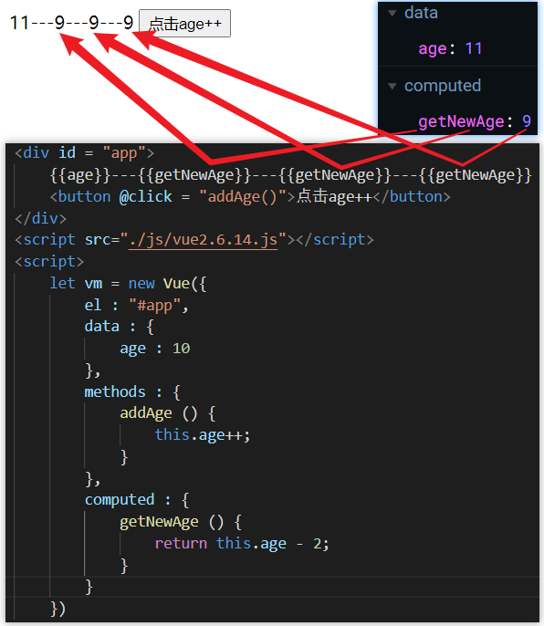
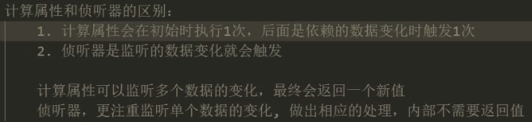

# 组件配置

### 配置数据源【data】

`data`配置项，用来提前配置该实例要使用的源数据。只有配置在`data`中的数据，才能在页面被渲染出来。

注意：

- `vue`会将`data`中的数据，直接挂载到该实例对象上，以方便调用。但这种关系是单向绑定的，由`data`决定。
  - 即：`data : {age : 18} ==> vm.age === 18; 若执行 vm.age = 10 只在vm上添加age，并且可能报错`
- `vm`上还有两个属性是与`data`数据源双向绑定的：`_data`和`$data`，三者指向同一个引用。
- 即使通过`_data`或`$data`属性在`data`中添加了数据，它们也无法被获取直接挂载到组件实例上或渲染到页面中。
- 因此，建议一开始就将需要的数据提前定义好或占好位。

提示：

- 当`data`是一个普通的对象时，所有组件都可共用该`data`中的数据。【共享数据源】
- 当`data`是一个方法时，它只限于在当前组件中提供使用数据。【独立数据源】

<hr>

### 配置函数【methods】

`methods`配置项，用来提前配置该实例要使用的计算方法。将复杂的逻辑定义在`methods`中，以供后期调用。

注意：

- 第一层普通函数的`this`都指向该实例`vm`，而第一层箭头函数的`this`没被修改，默认指向了`window`。
- 因此，第一层使用普通函数定义，后代层使用箭头函数定义。

<hr>

### 配置计算属性【computed】

`computed`配置项，用来提前配置该实例要使用的计算属性。将简单的求值运算定义在`computed`中，以供直接获取结果。

注意：

- `Vue`不希望在`{{}}`中定义计算表达式，建议只是通过`{{}}`来获取并渲染结果，而`computed`正是为此而生。
- `computed`是计算属性，而不是计算方法。它将计算后的结果，存在对应的属性中，方便`{{}}`直接获取结果。
- 在`{{}}`中一般只定义简单的计算，因为将求值运算定义在`computed`中，不仅避免代码臃肿，也更便于维护。


##### 原理机制

- 在`computed`内，通过定义方法的形式来定义。使用时不要手动添加`()`执行符，否则结果为`undefined`。
- `Vue`会将`computed`中的方法名作为`computed`的属性名，其`return`的结果作为属性值，被称为”计算属性“。
  - 例如：`computed : {calvalue () {return 123;}} ==> computed : {calvalue : 123}`
- `computed`中的方法会在项目初始运行时，全部执行一次`get()`，将得到的所有结果存到`computed`对象中。
- 当页面中需要使用计算属性时，会直接获取`computed`中的计算结果，而不是再次计算【惰性计算】。
- 计算属性函数的内部原理：`get()`和`set()`【`get`：计算数据结果；`set`：监听计算结果】
  - 将当前函数所有的求值运算式都放到`get()`中来处理，并在项目初始运行或重算数据时，执行一次。
    - 重算数据：当`get()`中依赖的任一响应式数据被修改时，都会导致`get()`重新计算一次。
  - 当试图对`computed`中计算属性的值进行覆盖时，才会触发一次`set()`，但不会触发`get()`重算数据。

惰性计算：项目初始化时通算一遍，只有当某属性内部依赖的数据发生变化时重算一次该属性的值。

```js
data() {
    return {
        age: 10
    }
}
computed: {
    getAge: {
        // getter：初次运行或响应式依赖项变化时，才会触发
        get () {
            return this.age++; // 必须使用return返回
        },
        // setter：仅当对该计算属性重新赋值时触发，并传值
        set (newVal) {
            this.age = newVal--; // 参数是当getAge在外部被重新赋值时的新值
        }
    }
}

vm.getAge // age === 11; getAge === 11;
vm.getAge = 20; // age === 19; getAge === 20;
```

提示：**计算属性是基于它们的响应式依赖进行缓存的**。只在相关响应式依赖发生改变时它们才会重新求值。

```js
computed: {
    // 挂载在vue实例上的才是响应式数据，一般来说：函数中带有this的都是响应式数据。
    reversedMessage: function () {
    	return this.message.split('').reverse().join('') // 依赖项是：this.message
  	}
    // 不带this的是方法内部定义的数据，不具有响应式，不属于依赖项。
    now: function () {
    	return Date.now() // Date.now()不属于依赖项
  	}
}
```

案例：

 

解析：

- 当`computed`计算结束后，所有的方法被作为计算属性来使用，方法的结果分别作为计算属性的值。
- 而当页面中使用`{{}}`等方法获取结果时，其实是到`computed`中获取计算属性的值。

注意：

- `{{++getNewAge}}`只能修改页面的呈现，`computed`中的计算属性`getNewAge`的值不会被更改。
- 因此，在需要频繁修改数据时，配置`computed`显得弄巧成拙。
- 定义在`methods`，`data`以及`computed`等配置中的属性方法，都会被直接挂载到`vm`实例上，重名会冲突。

<hr>

### 配置侦听器【watch】

侦听器通常用来监听`data`中的原始值数据，将数据的变量名作为`watch`中的方法名，数据变化时会触发该方法。

**注释**：`watch`与`computed`相似，但`computed`只用于简单求值，而`watch`用于复杂的处理，弥补了`computed`的不足。

使用：

- 以`data`中的变量名作为`watch`中的方法名，如：`data : {age : 10}; watch : {age () {}}`
- `watch`中的每一个方法都具有两个参数：`newValue`和`oldValue`，对应变化后与变化前的数据。

应用：

- 当需要监听页面上的异步数据变化时，使用`watch`可以非常方便地将结果传递给后端。
- 例如：购物车的数量限制，检查用户的登录状态、登录过期、合法昵称等。

注意：

- `watch`中普通函数的`this`指向该实例对象`vm`，不要使用箭头函数。
- 不要在监听数据变化的方法中，对监听数据使用自增减，否则会造成死循环。
-   

深度监听：在配置对象中设置`deep`项的值为`true`，将对侦听对象开启深监听。

```js
// 该回调会在任何被侦听的对象的 property 改变时被调用，不论其被嵌套多深
c: {
	handler: function (val, oldVal) { /* ... */ },
	deep: true // 对响应式依赖项开启深度监听，任一变化都会触发回调
},
```

立即监听：默认是当响应式依赖项发生变化时才触发回调，使用`immediate`可以立即触发监听回调。

```js
// 该回调将会在侦听开始之后被立即调用，项目就绪后，立即触发监听回调处理
d: {
	handler: 'someMethod',
	immediate: true
}
```

<hr>

### 注册组件

一般要在创建`Vue`应用实例 / 根组件之前，创建好各个子组件，以便直接将子组件挂载到根组件上。

##### 创建全局组件【`component`】

在`Vue`类上调用`component`方法，创建一个全局的子组件。

参数：`（组件名，配置对象）`

- 组件名：组件名在`Vue`模板结构中作为该组件的根标签来使用
  - 标准写法：全小写，多个单词以`"-"`连接，如：`"my-content"`
  - 大驼峰式：首字母统统大写。
- 配置对象：子组件的配置对象与根组件的配置对象功能及用法基本一致。
  - `data`：子组件的`data`不能直接使用对象形式，要通过`data`函数`return`出数据源配置对象。
  - `template`：子组件的模板结构（HTML部分），只能通过一个根节点挂载到`template`属性上。

挂载使用：

- 全局组件不需要挂载到根组件上，可以直接使用。
- 将组件名以标签的形式，直接插入到入口元素中，如：`<my-content></my-content>`。

```vue
<!-- 入口元素 -->
<div id = "app">
    <my-content></my-content> <!-- 全局组件直接插入到入口元素中即可 -->
</div>

<script>
	// 创建1子个组件(全局组件)
	Vue.component("my-content", { // 配置对象 
		// 组件中的data必须是函数，保证每一次使用该组件时的data相互独立，提高该组件的复用性。
			data(){
                return { // 每次使用该组件时，执行并返回一个新的对象。内容相同，但引用不同。
                    count: 0,
                    title: "内容组件"
                }
            },
		// 当前组件的模板结构: vue2只支持1个根元素  vue3支持多个
            template: `
                <div>
                    <p>---{{count}}---</p>
                    <button @click='count++'>点击修改组件的count</button>
                </div>
            `
     });
    
	// 创建vue应用实例对象(根组件) 
	const vm = new Vue({
		el: '#app',
        data: { // 数据共用，使每一个子组件都可以访问根组件的数据，访问同一个引用。
        	
        },
    });
</script>
```


##### 组件复用

封装组件的意义在于：复用组件，以便于模块化开发。

复用组件的关键在于：

- 每一次使用该组件时，其`data`要相互独立，保证数据不共通。这就是子组件的`data`必须通过方法返回的原因。
- 根组件中的`data`使用对象，是为了使每个子组件都可以访问到同一个引用，实现根数据的共用。


##### 数据传递【props】

`props`可以让使用者（父组件）很方便地向其子组件提供它们所需要的数据。

封装可复用组件时：

- 组件的结构、样式要尽量能够满足多种需求【结构和样式要首先能够复用】
- 组件中要展示的数据，尽量由它的使用者（父组件）来提供【数据结构要复用】

