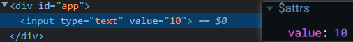
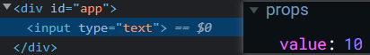

# 组件配置

### 组件通信【props】

在子组件中配置`props`项，用来接收父组件传递过来的数据，实现父子组件间的通信，单向的父传子。

子组件通过配置`props`属性，来决定要接收哪些数据属性（`class`和`style`除外），通常使用一个数组来接收。

注意：`props`接收的是其组件元素上的已有属性，因此要传递父组件数据，必须将它们绑定为属性值。

使用：

- 首先应在子组件的根标签上，通过属性定义要传递的静态数据或绑定需要父组件传递的动态数据。
  - 定义数据：`<blog title = "丸子" tag = "一个向往摸鱼生活的程序媛"></blog>`【静态数据】
  - 绑定数据：`<blog :title = "title" :tag = "tag"></blog>`【动态数据】
- 然后在`props`中决定要接收的数据，数据名与组件标签上的数据属性名要对应一致。
  - 如：`props : ["title", "tag"] // 接收组件标签上title和tag属性的值`
- 在`props`上声明的接收数据，也会像`data`、`methods`等配置项一样，被直接挂载到该组件的实例（顶层作用域）上。
  - 即：可以直接在该组件中，使用接收过来的数据，如：`<p>{{title}}</p>`
- 父组件传递的数据类型，可以是引用类型。`Vue`会自动解套，将数据还原回初始模样。
  - 一般地，传递的引用数据会先经过包装，以方便传输。而使用时，需要解套数据。

```html
<div id = "app">
	<blog :title = "title" :tag = "tag"></blog> <!-- 在此通过属性绑定，将父组件的数据传递下去 -->
</div>
<script>
Vue.component('blog', {
    props : ["title", "tag"], // 在此决定要接收根标签上的哪些属性的数据，无法接收class和style属性
    template : `
    	<div>
    		<h2>{{title}}</h2> // 在props中接收的属性，会被挂载到该组件实例上，在此可以直接使用
    		<p>{{tag}}</p>
    	</div>
    `
});
    
const vm = new Vue({
    el : '#app',
    data : { // 根组件中的共享数据
        title : 'wanzi', 
        tag : '一个想玩摸鱼生活的程序媛'
    }
})
</script>
```

注意：

- `props`配置单向的父传子的数据，子组件可以修改已接收的数据（可能警告），但没有修改父组件数据源的权限。
  - 即：提供的数据，由提供者来修改，这种方式使得通信数据便于统一管理。
- 当子组件需要父组件修改通信数据时，可以通知父组件做出相应的修改操作。


##### 结合v-for指令渲染

```html
<div id = "app">
	<blog v-for = "item in articleTitles" :title = "item.title" :key = "item.id"></blog> 
</div>
<script>
Vue.component('blog', {
    props : ["title", "key"], // 接收当前组件标签上title和key属性的值
    template : `
    	<div>{{title}}</div>
    `
});
    
const vm = new Vue({
    el : '#app',
    data : { // 根组件中的共享数据
        articleTitles : [
            {title : "Vue指令", id = 0},
            {title : "Vue组件", id = 1},
            {title : "Vue路由", id = 2}
        ]
    }
})
</script>
```


##### 传递校验

当配置`props`的值为对象时，可以在对象中设置对要接收的值进行校验的规则，如：限制类型，设置默认值等。

使用：

- 对要接收的属性，设置单独的校验规则，如：`props : {title : String} // 限定title的值类型为字符串型`
- 其值也可以是一个配置对象，如：`props : {title : {type : String, required : true}}`
- 可以为`type`类型指定一个数组，来扩大校验范围，如：`tag : [String, Number, Array]`
- 设置默认值，当该数据没传递时，使用默认值，如：`num : {type : Number, default : 10}`
- 自定义校验规则，在`validator () {}`中，通过返回值来决定是否通过校验，`true`通过。

注意：

- 对传递的数据进行校验，即使子组件限制了数据类型，但还是会强制按源数据传递过来，只是发出警告。
- 默认值，还可以通过函数处理后来决定默认值，如：`num : {default : function () {……; return …;}}`

```js
props: {
    a: String, // 通过instanceof来判断，是否是它的实例
    b: {
        type: Number,
        required: true,
        default: 10
    },
    c: {
        validator() {
            return true;
        }
    }
}
```


##### 通知修改

父组件传递给子组件的信息，子组件可以在接收后个性修改。这种修改只局限在自身，不会修改父组件的源数据。

即使子组件设置了数据的校验规则，也无法阻止父组件的源数据传递。

总之，当子组件需要父组件修改源数据时，可以通过自定义的事件通知对方，让传递者修改传递数据。

使用：

- 在组件标签上通过事件绑定指令自定义一个事件，通过该事件可以直接修改父组件的数据。
- 在组件的`template`模板结构中，定义一个事件，通过`$emit`来触发组件标签上的自定义事件。
- 自定义事件，通过使用`$emit()`方法来触发，第一个形参为事件名，其余形参为传参位。

注意：

- 组件标签定义在入口元素中，可以直接使用根组件的数据【处于根组件的范围中】
- `template`中的非根元素，可以直接使用组件标签上的属性【处于子组件的范围中】
- 最终，`Vue`会将组件标签替换为`template`中的根元素，各自的属性也会整合到一起。

案例：使用`$emit`传参，向根组件指定修改内容。

```html
<div id = "app">
	<blog :title = "tit" @update-title = "updateTitle"></blog>
</div>
<script>
Vue.component('blog', {
    props : ["title"],
    template : `
    	<div> // 组件根元素 === 组件标签，定义在<blog>上与定义在此处是一样的。
    		<p>{{title}}</p> // 组件的非根元素，可以直接使用该组件根元素上的属性。
    		<button @click = "$emit('update-title', '雀雀')">点击</button> // 自定义事件通过$emit来触发。
    	</div>
    `
});
const vm = new Vue({
    el : '#app',
    data : {
        tit : '欢迎来到丸子的世界！'
    },
    methods : {
        updateTitle (value) { // 接收子组件传参
            this.tit = value; // 将data的源数据修改为子组件传递过来的值
        }
    }
})
</script>
```

解析：

- 子组件通过`$emit()`触发`<blog>`上的指定自定义事件，同时携带了参数。
- `<blog>`触发自定义事件，执行其回调，回调函数接收参数并做出处理。


##### 使用事件对象

当子组件通过`$emit()`只传递一个参数时，自定义事件的`$event`用来接收该参数。

上面的案例可修改为：`<blog :title = "tit" @update-title = "tit = $event"></blog>`

```vue
<div id = "app">
	<blog :title="tit" @update-title="tit = $event"></blog> <!-- 直接将该参数赋予tit -->
</div>
<script>
Vue.component('blog', {
    props : ["title"],
    template : `
    	<div> 
    		<p>{{title}}</p> 
    		<button @click = "$emit('update-title', '雀雀')">点击</button> <!-- 唯一的实参会被$event接收 -->
    	</div>
    `
});
const vm = new Vue({
    el : '#app',
    data : {
        tit : '欢迎来到丸子的世界！'
    }
})
</script>
```


##### 解析`v-model`

`v-model`双向数据绑定，是一个语法糖指令。其内部原理是通过`v-bind`和`v-on`来实现的。

原理：通过`v-bind`绑定特定属性，通过`v-on`绑定相应的监听事件，并修改`data`中的数据。

注意：`v-model`默认绑定控件的`value`属性，以及默认使用`input`事件来监听`value`值的输入。

模拟`input`输入框的`v-model`：`<input :value = "msg" @input = "msg = $event.target.value">`

案例：利用`v-model`原理，结合表单元素，实现子组件通知父组件修改数据源。

```html
// 一般写法：将数据存到props属性中，而不是$attrs中。
<div id = "app">
	<my-input v-model = "age"></my-input>
</div>
<script src="./js/vue2.6.14.js"></script>
<script>
	Vue.component("my-input", {
		props : ["value"],
        template : `
			<label>
				年龄：<input type="text" :value="value" @input="$emit('input', $event.target.value)" />
            <label>
        `
	})

	const vm = new Vue({
		el : "#app",
        data : {
        	age : 10
        }
	})
</script>

// 解析v-model的原理，将子组件的修改要求通知到父组件
<div id = "app">
	<my-input :value = "age" @input = "age = $event"></my-input>
</div>
<script src="./js/vue2.6.14.js"></script>
<script>
	Vue.component("my-input", {
		props : ["value"],
        template : `
			<label>
				年龄：<input type="text" :value="value" @input="$emit('input', $event.target.value)" />
            <label>
        `
	})

	const vm = new Vue({
		el : "#app",
        data : {
			age : 10
        }
	})
</script>

// 单元素写法
<div id = "app">
	<input type="text" :value="age" @input="age = $event.target.value" />
</div>
<script src="./js/vue2.6.14.js"></script>
<script>
	const vm = new Vue({
		el : "#app",
        data : {
        	age : 10
       	}
	})
</script>
```

注意：

- 数据存到`props`中，该数据及属性就不会出现在元素控件上。而存到`$attrs`中，则可以看到通信属性及值。

-    
- 组件标签上的数据属性，只能被`props`或`$atrrs`接收：出现在一个对象中，就不会出现在另一个对象中。


