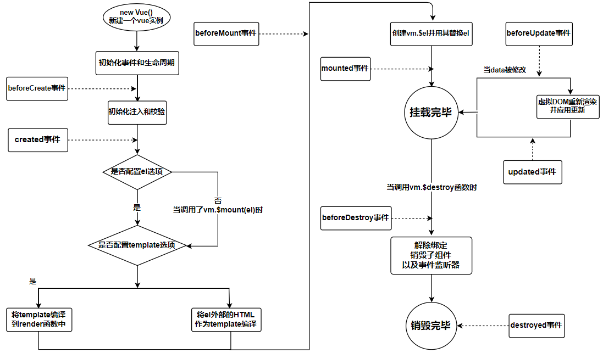
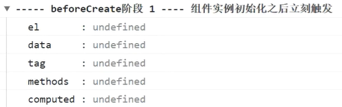
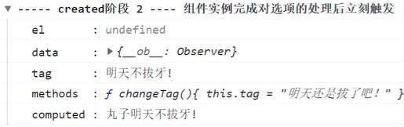
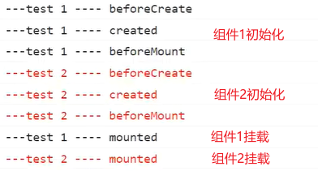
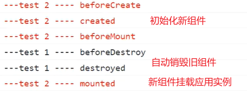

# 生命周期

`Vue`组件的生命周期：创建 ==> 运行（渲染）==> 结束（销毁）三大阶段。每个阶段的前后时间点自动触发对应的钩子函数。

钩子函数：设置在某个时间点的函数，到点了自动调用运行。

<hr>

### 流程图


<hr>

### 生命周期阶段

 


##### 创建实例阶段

创建实例阶段：由`new Vue()`、初始化事件和生命周期、初始化注入和校验三个过程组成。

`new Vue()`：创建一个空的`Vue`实例对象。

初始化事件和生命周期：处理好应用实例能够运行起来的前提准备（基础事件、生命周期）。

初始化注入和校验：在`Vue`实例中注入配置对象上定义的属性及值。


##### 挂载应用阶段

挂载应用阶段：由是否配置了`el`项、是否配置了`template`项、创建`$el`替代`el`三个过程组成。

配置`el`选项：判断实例中是否配置了`el`选项或调用了`$mount`方法【是否指定了入口元素，并未挂载元素】

配置`template`选项：判断实例中是否配置了`template`选项，并进行相应的编译处理，生成`DOM`结构。

创建`$el`替代`el`：使用`$el`替代`el`，将应用实例挂载到入口元素上。


##### 项目运行阶段

创建实例阶段与挂载应用阶段发生在项目初始运行时，由系统自动触发。

修改数据，销毁组件等属于项目运行阶段，由用户来操作执行。

<hr>

### 钩子函数

##### `beforeCreate`事件

`beforeCreate`事件发生在初始化事件和生命周期之后，在初始化注入和检验之前。

注意：此时数据并未挂载到应用实例上，读取不到任何数据和选项。

 


##### `created`事件

`created`事件发生在初始化注入和校验之后，配置`el`选项之前【此时，`el`仍为`undefined`】

注意：此时除`el`外所有选项的数据都已被注入到实例中，`data`，`computed`，`methods`，`props`等选项中的数据也被挂载到了实例上。

 

在`beforeCreate`事件和`created`事件中，都可以定义少量的`Ajax`请求，去异步加载资源。


##### `beforeMount`事件

`beforeMount`事件发生在`DOM`结构生成之后，应用挂载到元素之前【此时，`el`已指向入口元素】

注意：此时`el`已明确要挂载的入口元素，但还未真正挂载上去。其内部的`__vue__`属性仍为`null`


##### `mounted`事件

`mounted`事件发生在应用挂载到元素上之后，挂载阶段完毕之前【此时，所有内容已准备就绪】

注意：此时`$el`已替代`el`，应用成功挂载到了入口元素上。入口元素上的`__vue__`属性指向该应用实例。


##### `beforeUpdate`事件

`beforeUpdate`事件发生在系统监听到修改数据的操作之后，真正开始修改之前。

注意：此时可以设置拦截修改数据的操作，检查用户是否具有修改权限。


##### `updated`事件

`updated`事件发生在数据已被修改，并被响应到页面上之后。

注意：此时可以通知用户数据修改成功或跳转页面。该事件中可以执行耗时任务，发起大量`Ajax`请求。


##### `beforeDestroy`事件

`beforeDestroy`事件发生在系统监听到`$destroy`操作之后，真正解绑组件之前。

注意：此时，可以解绑全局性事件，以及第三方的定时器等。


##### `destroy`事件

`destroy`事件发生在组件解绑与`DOM`的基本关联之后。

注意：此时，可以清理与组件相关联的东西。


##### 注意事项

数据每执行修改一次，都会先后触发`beforeUpdate`事件和`updated`事件。

因此，在`beforeUpdate`事件和`updated`事件中，不要定义来回修改同一数据的操作，否则会造成死循环。

```js
// 死循环
const vm = new Vue({
    el : "#app",
    data : {
        tag = "丸子"
    },
    beforeUpdate () {
        this.tag = "小仙女"; // 来回修改同一数据
    },
    updated () {
        this.age = "小可爱";
    }
})
```

<hr>

### 切换组件

当同时使用多个组件时，会先对所有组件统一进行三步处理：按组件顺序依次执行完`beforeCreate`、`created`和`beforeMount`事件。

执行完这三个事件后，标志着每个组件的初始化已完成，各个组件都可以在直接挂载后投入使用。

注意：若没有指定挂载的时机，则会按组件的顺序依次挂载相应的应用实例，并触发`mounted`事件。

 


##### 动态切换

使用动态组件，来决定渲染哪个组件时，只会执行当前组件生命周期钩子函数。

然而，每一次切换组件后，系统会先对新组件进行初始化处理，然后自动销毁原先的组件，最后才允许新组件挂载使用。

 

注意：每个组件执行到`mounted`事件时，只能确保自身组件挂载完毕，不能确保子组件是否挂载【每个组件都有自己独立的生命周期】

