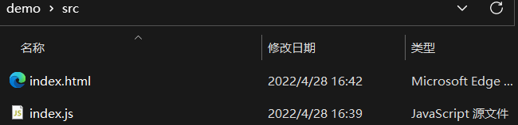
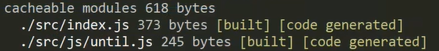

# `webpack`初始

`webpack`主要解决的问题：

- 引入`JS`文件时，必须严格遵守顺序。且引入过多，会导致加载时发起大量`HTTP`请求，影响页面加载速度。
- 在页面使用的高级语法（`sass`，`ts`等），浏览器无法识别，必须经过打包编译。
- `webpack`打包，整理清晰的包依赖关系，有利于项目工程化。

<hr>

### 安装`webpack`

##### 准备项目

准备一个项目文件夹，至少包含`src`子文件夹及相关的`html`和`js`这两种文件。

 

注意：以下所有操作均在项目根目录`demo`下执行，而不是在`src`中执行。


##### 项目初始化

`cd`切换路径到项目根目录，输入`npm init -y`初始化项目，输入以下指令安装到局部的开发环境中。

安装：`npm i webpack@5.70.0 webpack-cli@4.9.2 -D`


##### 检查版本号

输入`npx webpack -v`指令，检查安装版本号【`npx`表示进到该目录下执行指令】

<hr>

### 配置项目

##### 创建配置文件

在项目根目录下，创建该项目的配置文件`webpack.config.js`。没创建时使用默认的项目配置文件【不推荐】

在配置文件中，可以使用`node.js`相关的模块语法，如：`path`等。


##### 配置打包模式【mode】

在配置文件的导出对象中，配置`mode`项的值，以指定打包的构建模式。

- 开发模式：`development`
  - 开发模式打包的文件，体积较大，但便于阅读，适合线下开发调试使用【日常使用】
- 生产模式：`production`
  - 生产模式打包的文件较小，性能更好，适合最后上线时使用。

如：`module.exports = {mode : "development"} // 配置项目打包的构建模式为：开发模式`


##### 项目打包

输入`npx webpack`指令，打包当前项目。

`src`是我们日常工作的主要文件区域，打包时默认以`src`下的`index.js`作为入口文件，将与其相关的文件进行批量打包。


##### `dist`文件夹

项目打包后，会自动在项目根目录下创建一个`dist`文件夹，其内是打包整合后的`main.js`文件【解决了语法不兼容的问题】

`dist`是最终需要打包上线的文件夹，最终里面应存放着`html`，`js`，图片等基础文件。

输出台展示打包时的入口文件，以及与其相关联的文件等信息。

 


##### `main.js`文件

不同模式下，打包的`main.js`文件是不同的。

开发模式下：有注释和空格，保留原有命名；生产模式下：清除注释和空格，压缩至最短，变量命名简短。

注意事项：此时在i`ndex.html`文件中，要及时更改`script`标签的`src`引入路径为`../dist/main.js`。


##### 指定打包的入口文件【entry】

通过配置`entry`项的值，来指定打包的入口文件，如：`entry : path.join(_dirname, "./src/wanzi.js")`【绝对路径】


##### 指定打包的输出文件【output】

通过配置`output`项的值，来指定打包文件的名称及输出位置。

```js
const path = require("path");
module.exports = {
    mode : "development",
    entry : path.jion(__dirname, "./src/wanzi.js"),
    output : {
        // 指定打包文件的名称
        filename : "bundel.js",
        // 指定文件输出位置 / 目录，绝对路径
        path : path.jion(__dirname, "./pack")
    }
}
```

<hr>

### 自定义项目指令

可以在项目记录文件`package.json`中，配置`scripts`节点的对象，来自定义当前项目的相关指令。

使用规则：属性名为自定义的指令名，属性值为原始的项目指令。

##### 自定义打包指令

定义指令：`"scripts : {"build" : "webpack"}" // 使用build代替输入webpack`

使用指令：`npm run build // 打包项目，原指令为：npx webpack`

<hr>

### 热更新工具

每一次打包后的文件，仅保存打包时所存在的信息。当对文件中的代码进行修改后，需要再次打包出新的文件。

为了使开发者更专注于业务逻辑，可以使用`webpack`官方提供的`webpack-dev-server`工具【推荐`3.11.3`版本】

修改启动指令：`"serve" : "webpack serve"`，直接使用：`npm run serve`启动该热更新工具。

注意事项：

- 使用了该实时打包编译工具，配置的`entry`和`output`项就会失效，默认以`index.js`为入口文件。
- 该工具会默认将项目打包到本地服务器：`http://localhost:8080/`中运行。
- 当在服务器上打开`src`文件夹时，会默认展示`src`下的`index.html`文件。


##### 实时更新文件

使用`webpack-dev-server`工具，可以实时打包，实时编译文件。手动打包生成`dist`目录以及`main.js`文件。

然而，开启更新服务后，`webpack-dev-server`不会将更新内容放入`dist`下的`main.js`中【此文件夹仅手动打包更新】

而是在该项目根目录下，创建一个虚拟的`main.js`文件。可以通过`http://localhost:8080/main.js`或`/main.js`访问。

注意：当使用`html-webpack-plugin`工具后，会在根目录下生成一个虚拟的`dist`目录，包含实时打包后的`html`和`js`文件。


##### 配置`webpack-dev-server`插件

当需要手动指定打开服务器的`ip`或端口时，可以在项目配置文件的导出对象中配置`devServer`选项。

```js
// 项目配置文件：webpack.config.js
module.exports = {
    mode : "development",
    devServer : {
        open : true, // 初次实时编译后，自动打开浏览器运行编译好的html首页面。
        host : "127.0.0.1", // 指定服务运行的ip主机地址
        port : 8000, // 指定服务运行的端口
        https : true // 启动https服务（如有需要）
    }
}
```

<hr>

### 自动挂载入口文件工具

当不希望在`index.html`中手动引入`js`文件时，可以使用`html-webpack-plugin`工具，来自动挂载入口`js`文件。

安装：输入`npm i html-webpack-plugin@5.5.0 -D`安装`5.5.0`版本的工具。

首先安装该工具，然后在配置文件中引入该模块，返回一个构造器。

```js
// 安装好工具后，导入模块
const HtmlWebpackPlugin = require("html-webpack-plugin");
// 创建html插件的实例对象，添加配置内容
const htmlWPlugin = new HtmlWebpackPlugin({
    template : "./src/index.html", // 指定源网页文件的路径，复制源文件
    filename : "./index.html" // 指定生成的网页文件的存放地址（dist目录），粘贴文件至
});
module.exprots = {
    plugins : [htmlWPlugin] // 在导出对象中使用plugins，挂载指定的插件。
}
```

配置好内容后，就可以直接在`webpack-dev-server`运行的本地服务器中访问生成后的网页文件副本。

该网页文件副本会与`webpack-dev-server`工具联动，自动挂载相关的入口`js`文件，如：`main.js`

作用：

- 在根目录下生成一个`dist`目录，里面包含最终要发布上线的`html`和`js`两个基本文件。
- 在`dist`目录下自动将`js`文件引入同级的`html`文件中，不需要手动引入外部`js`文件。
- 在`webpack-dev-server`运行的本地服务器上，自动执行`dist`目录【寻找`html`文件】

注意事项：

- 当使用`webpack-dev-server`工具后，本工具生成的`dist`目录会不可见，并且在指定服务器的根目录下被直接执行。

