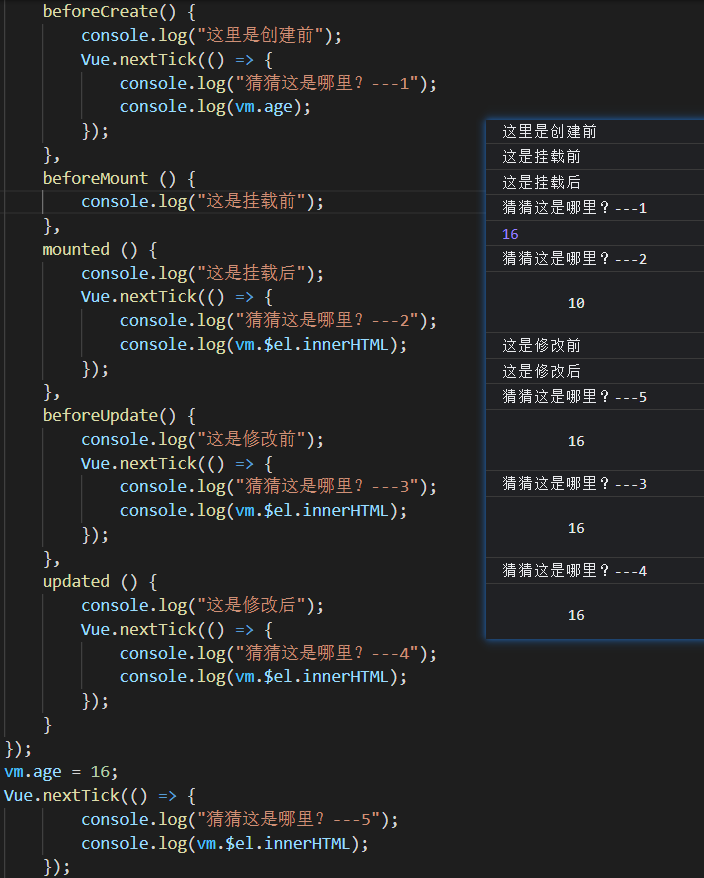

# 构造器、混入、自定义指令

### 构造器

##### 独立组件

使用构造器构造出来的组件，是独立于主体组件树之外的。它不会被渲染到主体的组件树上，通常用来做一些独立的`UI`组件。


##### 创建构造器【extend】

使用`Vue.extend()`方法，传入一个与子组件一样的配置对象，即可设计出一个构造器。返回值：构造类。


##### 创建子类

接收构造器的返回值，通过`new`的方式，创建一个子类（类似实例）。


##### 挂载元素

在创建子类的配置对象中，设置`el`挂载的元素，或调用`$mount()`方法挂载。【`template`完全替换挂载元素】

```html
<div id = "app">
    主体组件树
</div>
<div id = "box">独立组件</div>
<script>
    // 设计构造器
	const Profile = Vue.extend({
        data () {
            return {
            	name : "wanzi"  
            };
        },
        template : `<div>{{name}}</div>`
    });
    // 创建子类，挂载元素
    new Profile().$mount("#box"); // 或者：new Profile({el : "#box"});
    
</script>
```

<hr>

### 更新虚拟`DOM`

当用户修改数据时，先经过`beforeUpdate`，然后更改数据并更新虚拟`DOM`（响应视图），最后`updated`。


##### 异步响应视图

然而，`vue`在更改完数据后，更新虚拟`DOM`的操作是异步执行的。

要等到当前事件循环内所有的数据更改完后，才会开始更新虚拟`DOM`，这样的机制有利于性能优化。

```html
<div id = "app">
    {{age}} <!--这里显示响应后的数据：16-->
</div>
<script>
	const vm = new Vue({
        el : "#app",
        data : {
            age : 10
        }
    });
    // 同一个事件队列
    vm.age = 16;
    console.log(vm.$el.innerHTML); // 10
    /*
    	检测到vm.age = 16命令，先调用beforeUpdate，然后更改对应的数据。此时还未更新虚拟DOM，而是先委托管理。
    	当前事件循环中，遇到同步代码，执行打印入口元素的innerHTML内容。此时的内容还是原先的DOM内容。
    	当前事件循环中，所有同步代码执行完毕，开始执行异步回调。此时才开始更新虚拟DOM，将数据响应到视图。
    */
</script>
```


##### 监听视图更新【`nextTick`】

`Vue.nextTick()`是一个异步的方法，它在`DOM`视图更新完后立即触发其回调程序。

```js
vm.age = 16;
Vue.nextTick(() => {
    console.log(vm.$el.innerHTML); // 16
});
// 使用定时器等异步执行的方法，虽然可以打印视图更新后的内容，但它们并不总是能够幸运地在DOM更新后执行【争抢时间片】
setTimeout(() => {
    console.log(vm.$el.innerHTML); // 16
},0);
```


##### 子组件挂载

利用`Vue.nextTick`方法的机制，可以检查当前组件中的所有子组件及后代组件是否都已挂载并渲染完毕【即：整个视图渲染完毕】

```js
const vm = new Vue({
    el : "#app",
    data : {},
    mounted () {
        Vue.nextTick(() => { // 该方法写在mounted及之前时在mounted之后执行，写在mounted之后时在updated之后执行。
            console.log("当前组件及内部的所有组件都已挂载完毕");
        });
    }
})
```


##### 探索`nextTick`方法的执行时机

结论：

- 该方法写在`mounted`及之前的，统一到`mounted`执行后按序执行；写在`mounted`之后的，统一到在`updated`执行后执行。
- 由于`DOM`的视图更新发生在`beforeUpdate`之后，`updated`之前。因此，在`mounted`及之前使用`nextTck`访问的仍是旧`DOM`内容。
- 只有在`mounted`挂载完毕后，使用`nextTick`才能访问到每次`DOM`视图更新后的页面内容。

 

<hr>

### 混入

可以将多个组件中重复性的可共用的代码，提取到一个配置对象中。然后，在需要使用这些配置的组件实例中通过`mixins`导入即可。

混入配置对象与子组件的配置对象一样，也可以定义生命周期钩子函数【混入对象的钩子函数比自身钩子函数先执行】

在组件中配置`mixins`项来混入配置对象后，该配置对象中所有的属性方法都会直接被挂载到当前组件的实例对象上。


##### 局部混入

```js
let myMixin = {
    data () {
        return {
            mixinTag : "这是混入对象里的数据"
        }
    },
    methods : {
    	printText () {
            console.log(this.mixinTag);
        }  
    },
    created () {
        console.log("mixin---created", this.printText());
    }
};
const vm = new Vue({
    el : "#app",
    mixins : [myMixin], // 导入需要混入的外部配置对象
    data : {
        tag : "这是组件自身的数据"
    },
    created () {
        console.log(this.tag);
    }
});
```


##### 混入整合【优先自身】

混入配置对象中的内容会先被注入到实例中，然后注入实例自身配置对象的数据，一般冲突的部分会覆盖混入的内容。

如果混入配置对象中定义了生命周期钩子函数，会被整合到当前组件的钩子函数中，等待一起被执行【`mixin`的先执行】


##### 混入多个

当某组件需要混入多个配置对象时，会严格按照`mixins`数组中的顺序执行。


##### 全局混入

使用`Vue.mixin({})`方法，可以定义全局的混入配置对象。它们会自动作用于所有的组件上，不需要引入【极不推荐】

<hr>

### 自定义指令

当用户需要对普通`DOM`对象进行底层操作时，`Vue`允许注册自定义指令。

注释：自定义指令主要用来快速精确地获取`DOM`元素，常用在`UI`框架设计中。


##### 注册全局指令

使用`Vue.directive()`方法，可以自定义一个全局的`vue`指令。

参数：`（指令名，指令配置对象）`

- 配置对象
  - `inserted(el)`：`inserted`是该指令的一个生命周期钩子函数。
    - 当自定义`vue`指令作用的元素被添加到`DOM`结构中时，`inserted`会自动触发并获取到该元素将其引用传给`el`。

```html
// 自动获取焦点
<div id = "app">
    <input type = "text" v-wz />
</div>
<script>
	Vue.directive('wz', {
        // 当绑定的元素插入DOM中时，触发inserted
        inserted (el) { // 指令绑定的元素
            // 使元素获得焦点
            el.foucs();
        }
    })
</script>
```


##### 注册局部指令

在组件内部配置`directives`选项，可以自定义供该组件使用的局部`vue`指令。属性名为指令名，属性值为指令配置对象。

```js
const vm = new Vue({
    el : "#app",
    data : {},
    directives : { // 在组件内部注册局部的自定义指令
        wz : {
            inserted (el) {
                el.foucs();
            }
        }
    }
})
```

