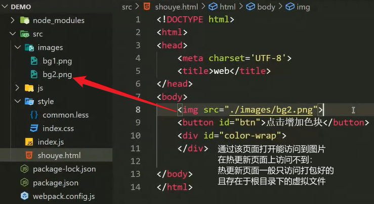

# 打包发布

对于一些高级语法，浏览器是无法识别的，浏览器只认原生的`HTML`、`CSS`以及`JS`这三种语法。

使用高级语法是有利于开发的，但必须经过相关的工具进行编译打包为浏览器识别的原生语法。

基本用法：

- `Vue`或`React`等框架，一般不会在首页面中引入过多的外部文件，而是在`js`或组件中引入。
- `webpack`默认只打包`js`文件。因此，使用`webpack`，外部文件要在`js`文件中`import`导入。
- 当页面引入入口的`js`文件时，会将这些外部文件一起导入到该页面中执行。

<hr>

### 导入`CSS`文件

在`js`文件中通过`import`导入相关的`css`文件后，需要借助两个工具，将`css`编译后插入到页面中。

```js
// js文件中导入css文件
import "./style/index.css" // 本地磁盘相对地址
```

输入`npm i css-loader@6.5.1 style-loader@3.3.1 -D`指令，安装两个`css`处理工具。


##### `css-loader`编译工具

使用`css-loader`工具，可以解析`css`代码并打包，最终返回浏览器能够识别的`css`代码【需要定义导出】


##### `style-loader`添加工具

使用`style-loader`工具，可以将模块导出的`css`代码添加到，该工具在页面上创建的`style`标签中。


##### 模块导出`css`代码

在`js`文件中导入`css`文件并经过`css-loader`工具的解析打包后，需要在`webpack.config.js`文件的导出对象中配置`module`选项。

```js
module.exports = {
    mode : "development",
    // 配置导入第三方模块的处理机制
    module : { 
        // rules：定义匹配规则，每一条规则都是一个配置对象
        rules : [
            {
                // test：匹配文件名称的正则表达式
                // use：指定处理该类型文件的loader工具，loader工具在数组中默认是从后往前被依次调用。
                test : /\.css$/, // 匹配处理css文件
                use : ["style-loader", "css-loader"] // 注意顺序不可错：先经css处理，再插入到style中
            },
        ]
    }
}
```

注释：当执行入口`js`文件时，遇到无法识别的文件（如：`css`）会首先到项目的配置文件中来寻找相应的处理规则。


#### 高级`CSS`编译工具

`sass`、`less`等高级`CSS`语法，不被浏览器识别，也无法通过`link`直接引入，需要借助`CSS`高级语法编译工具。


##### `less-loader`编译工具

使用`less-loader`工具，可以加载并编译`less`文件。由于`less`工具是`less-loader`工具的核心，因此需要两个包。

输入`npm i less less-loader -D`指令，下载`less-loader`以及它的核心包。

```js
// webpack.config.js - module.exports - module - 
rules : [
    {	// 配置普通css语法文件的处理规则
        test : /\.css$/,
        use : ["style-loader", "css-loader"]
    },
    {	// 配置高级css语法文件的处理规则
        test : /\.less$/i,
        use : ["style-loader", "css-loader", "less-loader"]
    }
]
```

<hr>

### 高级`JS`编译工具

由于目前各大浏览器均没有完全实现`ES6`的高级语法，为了使开发者的`js`代码能被所有浏览器兼容，需要转为`ES5`的语法。

使用`babel-loader`工具，可以解析`ES6+`的语法，并转换打包为`ES5`的语法。

输入`npm i -D babel-loader @babel/core @babel/preset-env`指令，安装`babel-loader`及其核心模块`core`。


##### 配置规则

在`rules`中配置`babel-loader`和`babel/preset-env`的使用。

```js
rules : [
    {
        test : /\.js$/, // 匹配js文件
        // 指定排除项
        exclude : /node_modules/, // 排除node_modules目录，避免找到第三方js文件。
        use : [
            // loader项：指定文件处理工具，即：匹配到的js文件用哪个工具来处理。
            loader : "babel-loader",
            options : { // 指定使用当前loader项工具的选配件
            	// 指定babel-loader的预处理工具，用来转换高级的js语法。
            	presets : ['@babel/preset-env']
            }
        ]
    }
]
```

<hr>

### 导入图片文件

写在`css`文件里的`url`等图片资源，在经过`import`导入`js`文件后，会跟随`css`文件一起被打包处理。

`css`文件中被处理的图片资源会被直接放在服务器地址根目录下使用，并经过`hash`处理，防止名冲突。


##### 导入图片资源

使用`webpack-dev-server`开启服务器热更新后，在本地的`html`文件中使用`img`引入相对本地磁盘的图片是失败的。

原因：【图片使用的是相对地址】

- `webpack`默认不处理图片文件，而是直接将``添加到热更新页面中。因此，图片的引用地址仍是本地磁盘的相对地址。
- 而热更新页面的位置是在项目的根目录或`dist`虚拟目录下，所以它根据`img`的`src`提供的相对地址找不到对应的图片资源。
-   

要想在热更新页面上也能访问到图片资源，就必须要经过`import`导入后打包处理，将它们直接存放在热更新页面的同级目录下。

```html
<body>
    <!--在html文件中-->
    <!--图片不使用src来直接引入，而是通过js来设置-->
</body>
<script>
    // 在js文件中
	import img from "./images/bg2.png" // 在js文件中通过本地磁盘的相对地址，导入图片文件并使用img变量接收
    let oImg = document.querySelector(".showimg");
    oImg.src = img; // 将经打包处理后的图片内容，赋值给html页面中的img标签。
</script>
```


##### 内置图片处理工具

`webpack`默认不识别图片资源，但可以借助`webpack5`提供的`asset modules`工具，来对图片资源进行处理。

```js
rules : [
    {	// 配置处理图片资源的规则
        test : "/\.(png|svg|jpg|jpeg|gif)$/i", // 匹配这几类图片文件
        type : "asset/resource", // 指定处理的类型
        /*
        	asset/resource：保持图片原类型，适用于大图片，每次加载使用http请求。
        	asset：根据图片体积自动处理---小图片输出为data URL（hash的base64格式）；大图片保持原文件类型。
        	小图片：输出为base64格式的代码文本，加载时直接data引入解析为图片即可。大图片的每次加载则使用http请求。
        */
        // generator：配置图片的输出路径及名称
        generator : {
            // filename：指定打包后的图片名称。不过为避免重名，一般使用默认的hash字符串命名：[hash][ext][query]。
        	filename : "imgs/[hash][ext][query]" // 修改图片存储地址为：与热更新页面文件同级的imgs虚拟文件夹中。
        }
    }
]
```

<hr>

### 打包发布

在确定配置好所有文件后，将`mode`修改为`production`，生成要上线的项目包【在项目根目录下生成`dist`文件夹】

此时`dist`文件夹中应包含所有要上线的文件，如：`html`、`css`、`js`、`imgs`图片文件夹等【最后提交`dist`上线即可】

