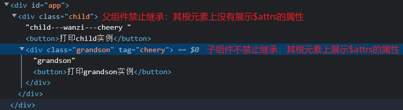

# 组件高阶

### `Vue`实例属性

`Vue`实例对象上原生（系统默认）的属性，都是以`$`或`_`开头的。在`data`中，使用这两个符号命名的属性不会被直接挂载到实例上。

隐式属性：在`data`中定义的这些属性会被作为`data`的内置属性来对待，`Vue`不会主动捕捉并处理它们【普通属性不推荐】

##### $props：接收数据对象

在组件配置中定义`props`接收到的所有数据，都会以对象的形式存储到该组件实例的`$props`属性中。

##### $el：应用挂载元素

在组件配置中使用`el`或在实例上使用`$mount()`绑定的挂载元素，会被存放在实例的`$el`属性中。

##### $options：实例配置对象

创建实例时使用的配置对象，会被存储到实例的`$options`属性上。

注意：配置对象的第一层属性是默认属性。自定义的属性，不会被直接挂载到实例上，但会存在于`$options`中。

`tips`：一般，没有被`Vue`直接挂载到实例上的属性，作为静态数据来使用。`Vue`不会响应处理它们【视图不响应】

##### $children：子组件数组

在`DOM`结构上，当前组件的所有子组件 / 子元素，都会以数组的形式存放到该组件实例的`$children`属性中。

##### `$parent`：父组件实例

在`DOM`结构上，当前组件的父组件，会以对象实例的形式存到该组件实例的`$parent`属性中

##### $root：根组件实例

在`DOM`结构上，当前组件树的根组件，会以对象实例的形式存储到该组件实例的`$root`属性中。

注意：在当前组件中使用父组件或根组件的引用`$parent`以及`$root`，都可以直接修改其中的数据内容【不好维护，不推荐】

##### `$refs`：子组件 / 子元素引用

在`DOM`结构上，当前组件内绑定了`ref`属性的所有子组件 / 子元素，其自定义的引用都会被存到其父对象实例的`$refs`属性中。

<hr>

### 响应处理

`Vue`是以数据驱动视图变化为原则设计的。然而，对数组以及对象使用`.`或`[]`的方式修改的数据，不会响应到视图变化上。

`Vue`在对数组以及对象使用原生`JS`的增删改查方式做的数据操作，不会进行视图的响应处理【数据变化，视图不变】

##### 注意事项

能够直接被挂载到组件实例上的数据，才具有响应式。

由于`JS`的限制，`Vue`不能检测数组和对象的变化。导致数据更改了，视图无法响应的现象。

`Vue`不处理这方面的原因也很简单：因为性能的消耗与用户的体验不成正比。


##### 使用`API`

因此，为了保证对数组和对象变化的响应，`Vue`对数组和对象的`API`做了适当的处理，并建议使用这些`API`来修改数据。

```html
<div id = "app">
    {{arr}}---{{obj}}<br/>
    <button @click = "changeData">点击修改</button>
</div>
<script>
	const vm = new Vue({
        el : "#app",
        data : {
            arr : [10, 20, 30, 40],
            obj : {
                name : "wanzi"
            }
        },
        methods : {
            changeData () {
                // 无效修改：数据变化了，视图不响应【通过键直接修改是不响应的】
                this.arr[2] = "樱桃";
                this.arr[5] = "朱雀";
                this.obj.age = 10;
                // 使用API修改，如：push，pop，splice等
                this.arr.splice(0, 1, "玄狐");
                this.arr.splice(4, 0, "晓虹");
            }
        }
    })
</script>
```


##### 使用$set

在实例对象上，`data`中的每条数据都具有`get`和`set`这两个方法。实例上的`$set`用来设置数据，并会引起视图的响应式变化。

修改数组：`this.$set(数组, 索引, 改入的数据) // 要修改的数组，修改的位置，置入的数据`，如：`this.$set(this.arr, 0, "雀雀")`

修改对象：`this.$set(对象，键名，改入的数据)`

```js
// 在对象中添加一条数据
this.$set(this.obj, "addData", "新添加的数据");

// 在对象中添加多条数据，使用Object.assign()方法（将后续参数的数据全部赋予第一个参数）
Object.assign({}, this.obj, { a: 1, b: 2 }) // 将obj与{ a: 1, b: 2 }的数据全部分配到{}中，返回分配后的对象

// 在obj中批量添加新的数据，如：{ a: 1, b: 2 }
this.obj = Object.assign({}, this.obj, { a: 1, b: 2 }) // assign：分配，赋予
```


##### 删除数据$delete

原生的`delete`操作符可用来删除数组及对象中的某一条数据。删除数组中的数据，不会重排索引，而是以`empty`占位。

`Vue`在每个实例对象上也提供了修改后的`$delete`方法，使用时指定要删除的数组或对象，以及删除的键名。

```js
this.$delete(this.arr, 3);  // 删除arr数组中索引为3的数据，并重排索引
this.$delete(this.obj, "name");  // 删除obj对象上键名为name的数据，键名必须是字符串形式
```

<hr>

### 根标签属性`$attrs`

每个组件中没有使用`props`来接收的传递数据，都会被存放到`$attrs`中，并作为当前组件根元素的属性来使用。

向下传递：

- 父组件可以不使用`props`接收数据，而将数据继续向下传递。
- 子组件通过`v-bind="$attrs"`来绑定父组件的`$attrs`对象。

注意：

- 即使向下传递了，父组件的`$attrs`中仍具有这些数据。子组件只是将父组件实例上`$attrs`的数据绑定到自身的`$attrs`中。
- 因此，父组件一旦使用`props`接收，子组件就接收不到了。此时，应使用`:`或`v-model`指令来绑定数据。
- 父组件使用`inheritAttrs : false`禁止其根元素继承`$attrs`属性后，子组件不会受其影响。

```html
// 向下传递
<div id = "app">
    <child title = "wanzi" tag = "cheery"></child>
</div>
<script>
	Vue.component("child", {
        template : `
        	<div class = "child">child
    			<grandson v-bind = "$attrs"></grandson> <!--子组件绑定父组件实例的$attrs属性-->
    		</div>
        `
    });
    Vue.component("grandson", {
        template : `<div class = "grandson">grandson</div>`
    })
</script>

// 禁止继承
<div id="app">
        <child title="wanzi" tag="cheery"></child>
    </div>
    <script>
        Vue.component("child", {
            inheritAttrs : false,  // 父组件禁止继承
            props : ["title"],
            template: `
            	<div class = "child">child---props：{{title}}---$attrs：{{this.$attrs.tag}}
                    <button @click = "logThis">打印child实例</button>
        			<grandson v-bind = "$attrs"></grandson>
        		</div>
            `,
            methods : {
                logThis () {
                    console.log(this);
                }
            }
        });
        Vue.component("grandson", { // 子组件不禁止
            template: `<div class = "grandson">grandson
            				<button @click = "logThis">打印grandson实例</button>
        				</div>`,
            methods: {
                logThis() {
                    console.log(this);
                }
            }
        });
        const vm = new Vue({
            el : "#app"
        })
    </script>
```

结果：父组件禁止继承，并不会影响子组件接收数据或继承属性。

  

