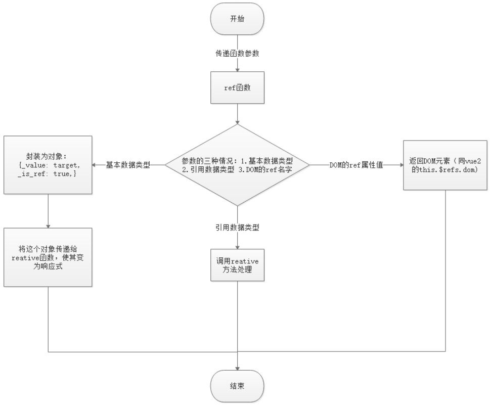

# 组合式`API`

官方建议：一旦使用了`setup`选项，就不应该再使用`vue2`的选项式`API`，推荐使用`<script setup>`。


##### 最先执行

`setup`方法，在组件创建的钩子函数之前执行，即：早于`beforeCreate`函数执行。

因此，在`setup`全局中的`this`为`undefined`，方法中则指向该`setup`的代理对象。

```js
export default {
    name: "App",
    setup () {
        console.log(this); // undefined；因此在setup中使用this的意义不大。
        
        function test () {
            console.log(this); // setup代理对象，局部的全局对象。
        }
    }
}
```

**注释**：在`setup`中的写法非常类似原生`js`的写法，其中普通函数内部的`this`初始时亦指向**“局部的全局对象”**（`setup`的代理对象）。

<hr>

### 响应式`API`

在`vue3`的项目中，只有响应式的数据才会被作为组件实例上的数据来使用。

**注释**：在`setup`中定义的数据和方法，必须使用`return`返回出去，才能被挂载到组件实例上以便直接使用。

**包装类**：但是，`return`的基本类型数据无法在页面上响应。因此，必须借助响应式`API`将其包装为响应式的数据对象。


##### `ref`：原始值包装

`ref`方法：用于将简单的数据类型包装为`RefImpl`的响应式数据对象，其值被存储在各对象的`value`属性中。

**提示**：若需要取其值参与非赋值的运算，应先通过`value`属性访问其值。赋值运算使用新的响应式数据覆盖即可。

**注释**：当使用`return`将包装的响应式数据返回出去时，`vue`会自动将数据对象解套，直接将其`value`以同名属性提供给组件实例。

```js
setup () {
    let name = ref("丸子"),
        age = ref(10);
    
    age.value++; // 11
    age = ref(20);
    
    return {
        name, // 返回出去的仍是原始值，但具有响应式的功能。
        age
    };
},
created () {
    console.log(this.age); // 20；return时已被转换为原始值，直接使用即可。
}
```


##### `reactive`：引用值包装

`ref`推荐用来转换基本类型的数据，当使用它去转换复杂类型的数据时，会调用`reactive()`来包装处理，在`value`上又包装了一层。

`reactive`方法：用于将复杂的数据类型直接包装为`proxy`的响应式数据对象，直接使用即可，但不可用来包装原始值。

**注释**：通过`reactive`方法包装的引用值响应式对象，默认进行深度追踪。也就是里面嵌套的数据也具有响应式功能【递归】。

```js
let obj = reactive({name: "cheery"});
console.log(obj.name); // "cheery"

let o = reactive({name: "wanzi", hobby: {movie: "加勒比海盗", game: "王者荣耀"}});
```

​                      

```js
// 当将 ref 分配给 reactive property 时，ref 将被自动解包。

const count = ref(1);
const obj = reactive({});

obj.count = count; // 自动解包，无需value

console.log(obj.count); // 1
console.log(obj.count === count.value); // true
```


##### 响应式变化

在`vue2`中，当直接对数组和对象通过`.`或`[]`的原生方式访问其成员时，数据虽然改变了，但响应不到视图上。

在`vue3`中，全面使用`proxy`代理对象替换`vue2`的`defineProperty`之后，如上两种方式也能够成功响应视图。

```js
data () {
    return {
        arr: [1,2,3],
        obj: {name: "wanzi"}
    };
},
methods: {
    changeData() {
        // 通过.或[]的原生访问方式，修改数据。在vue2中无法更新虚拟DOM，但在vue3中可以。
        this.arr[0] = 0;
        this.arr.length = 10; // 空位数据为undefined；视图上为null。
        
        this.obj.name = "丸子";
        
        delete this.obj.name;
    }
}
```


##### 解构赋值

不要在`setup`中，对响应式对象的原始属性进行解构取值或通过`value`重新赋值，这些操作返回出来的仍是原始值，不具有响应的功能。

**注释**：对响应式对象中原始值属性的解构赋值只是栈层面的简单拷贝，拷贝值与源原始值相互独立，不具有任何关联。

```js
setup () {
    // 对响应式对象的原始值属性进行解构赋值，简单拷贝的过程
    let value = ref(0).value,
        {name, age} = reactive({name: "wanzi", age: 10});
    
    return {
        value,
        name,
        age
    }
}
```

**双向绑定**：而如果想要在拷贝值与源值之间建立一种双向的数据关联，则必须将源原始值包装为`ref`对象，可以通过`toRef`来实现。

**注释**：`toRef`是将对象中的某条原始值属性包装为`ref`对象；而`ref`则是将对象中的原始值取出后包装为`ref`对象，并无双向关联。

**提示**：`toRef`只针对响应式对象并且只包装单条属性，要包装某响应式对象的所有属性，可使用`toRefs`方法，传入该响应对象即可。

**注释**：直接`return`返回使用`toRefs`包装的对象后，可在页面中直接使用其根属性。

```js
setup () {
    let obj = reactive({name: "wanzi", age: 14}),
        name = toRef(obj, "name"), // 第一个参数为源对象，第二个参数为对象里的源原始值属性。
        age = toRef(obj, "age"); // 被包装为RefImpl对象后再拷贝，两者指向同一地址。从而实现了双向绑定。
    
    name.value = "cherry";
    
    /* 注意：ref和toRef的区别 -- 取出后包装 or 包装后取出
    	- ref：是将对象中的原始值取出后包装，如：ref(obj.tag) => let o = obj.tag; o = ref(o);
    	- toRef：是将对象中的源值包装后返回，如：toRef(obj, "tag") => obj: {tag: ref("tag")};
    */
    
    // 绑定响应式对象的所有属性，并将这些ref对象置入一个空对象中。
    let objRefs = toRefs(obj);
    console.log(objRefs); // {name: ObjectRefImpl, age: ObjectRefImpl} 普通对象
    
    // 由此，可以直接解构使用，共用指针。
    let {name, age} = toRefs(obj);
    
    // 直接返回toRefs包装的对象后，可在页面上直接使用其根属性。
    return objRefs;
}
```


##### 数据覆盖

在`setup`中通过`return`返回一个对象，其中所有属性和方法都将被直接挂载到组件实例上。

**误区**：`setup`早于`beforeCreate`执行，但它却是将数据最后才挂载给组件实例的。

因此，`setup`返回的数据如果与其他选项中的数据重名，以`setup`返回的为准。【使用`setup`是`vue3`的趋势】

<hr>

### `setup`深入

##### 自定义渲染函数

`setup`的返回值：为对象时用来导出数据；为方法时用来自定义渲染函数。

在`vue2`中，只在全局的`vue`实例上挂载渲染函数：`new Vue( render: h => h(App));`

在`vue3`中，可通过`setup`的`return`返回一个渲染函数的回调去执行。

参数：

- 一：要渲染的元素节点，如：`"div", "span", "p"`等等【字符串形式】
- 二：该元素节点的属性，如：`{className: "wanzi", title: "标签"}`【对象形式】
- 三：该元素节点的内容，如：`"丸子", ["丸子", "樱桃"]`【字符串或数组形式】

```js
// 从vue中导入h渲染函数回调方法
import {h} from "vue"
setup () {
    let arr = [1, 2, 3, 4],
        handleClick = () => {
        	console.log("setup点击事件");
    	};
    
    // 单个渲染函数
    return () => h("div", {title: "div元素"}, ["丸子", "樱桃"]);
    // 多个渲染函数，以数组包含多个渲染回调处理
    return () => [
        h("div", {title: "div元素"}, ["丸子", "樱桃"]),
        h("span", {title: "span元素"}, ["丸子", "樱桃"]),
        h("button", {title: "button元素", onclick: handleClick}, "点击"),
        h("ul", null, arr.map(item => {return h("li", item);})) // 循环生成
    ];
}
```


##### `setup`的参数

选项式的`setup`具有两个参数：`props`和`context`。

`props`：通过`props`选项已定义接收的父组件传递的数据，被以对象的形式作为第一形参传递给`setup`函数。

`context`：上下文对象（非响应式），具有`attrs、emit、expose`和`slots`四个基本属性。

```html
<!-- 在父组件中 -->
<Home class="home" title="首页" @test="hanle" />

<!-- 在当前组件中 -->
<script>
	export default {
        name: "Home",
        props: ["class", "title"], // 接收父组件传递的数据，存储在一个proxy对象中
        emits: ["test"], // 接收父组件传递的自定义方法
        setup(props, context) {
            // props等同于this.$props
            /*	context中最常使用的是attrs、emit、slots。
            		attrs等同于this.$attrs，表示未接收的传递数据
            		emit等同于this.$emit，表示执行emits接收的自定义事件
            		slots等同于this.$slots，表示插槽
            */
            context.emit("test"); // 执行接收的自定义事件
        },
        // setup(props, {attrs, emit, slots}) {} // 参数解构
    }
</script>
```

**`expose`属性**

`expose`属性用于指定通过`ref`在该组件实例对象上可访问的数据。【暴露特定的属性】

**提示**：在`vue2`中，通过`this.$refs`可访问绑定过`ref`的所有组件实例，从而轻松访问某组件的所有数据。

**组件封装性**：`vue3`建议，组件应具有良好的封装性，其数据不能被其他组件通过该组件的`ref`引用随意访问，应指定部分可访问。

**注释**：当通过`expose`在`setup`中指定暴露数据后，所有组件通过该组件引用，只能访问到该组件暴露出来的数据，而不是整个实例。

**提示**：

- 通过`expose`导出的数据被转换为`RefImpl`对象，存在一个新的代理对象中，通过`ref`访问到的正是这个代理对象。
- 被导出的响应数据对象，也会被自动解套，在外部可直接使用。如：`this.$refs.child.data`

```html
<!-- 在父组件中获取子组件实例的引用 -->
<template>
	<Home ref="child" />
</template>

<!-- 在父组件中 -->
<script>
	export default {
        name: "App",
        components: {Home},
        mounted () {
            // 通过this.refs.child引用获取子组件的实例对象，此时可访问其全部的数据。
            // 当在子组件中通过expose指定暴露数据后，则只能访问其导出的特定数据，而不是整个组件实例对象了。
            console.log(this.$refs.child); // 一个Proxy对象，其中包含子组件中导出的data（RefImpl对象）
        }
    }
</script>

<!-- 在子组件中 -->
<script>
	export default {
        name: "Home"
        setup (props, {expose}) {
            let data = ref(0);
            // 指定可以被外部的ref访问的数据，主动暴露该组件愿意公开分享的数据。
            expose({
                data
            })
        }
    }
</script>
```

