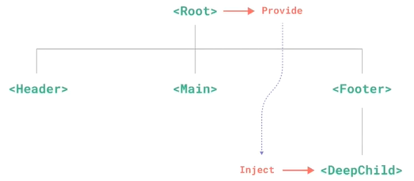

# 组合式`API`

### 浅响应

##### 浅监听

使用`reactive`方法包装的响应式对象，默认通过递归监听其深层次的属性和方法。当层级较深时，非常浪费性能。

当只需要监听根属性的数据时，可使用`shallowReactive`方法将对象包装为只监听根属性的响应式对象。

```js
setup () {
    // 例如：请求的响应对象，只需要监听根属性是否有数据即可。
    let response = {
        code: 200,
        msg: "成功",
        data : {
            id: 8,
            test : {
                a: 10,
                b: 20
            }
        }
    };
    let responseShallow = shallowReactive(response); // 转换为proxy对象，只监听根属性。
}
```

提示：对应的还有一个`shallowRef`方法，它将对象包装为`ref`对象，由于其根属性是`value`属性，因此只监听其`value`属性。

```js
setup () {
    let obj = shallowRef({
        code: 200,
        msg: "成功",
        data : {
            id: 8,
            test : {
                a: 10,
                b: 20
            }
        }
    })
    console.log(obj); // 一个ref对象，仅当其value值变化时触发响应。
    
    obj.value = {code: 400, msg: "失败", data: {id: 10, test: {a: 42, b: 22}}};
}
```


##### 转回深监听

使用`shallowRef`方法，将一个对象包装为浅监听的响应式对象后，可使用对应的`triggerRef`方法将对象转回深监听。

注释：需要在修改深层数据的同一个作用域下，使用`triggerRef`方法，才能将包装的浅响应式对象转换为深响应对象。

```js
setup () {
    let obj = shallowRef({
        	name: "wanzi",
        	age: 14,
        	info: {
            	friend: "cherry",
            	hobby: {
                	movie: "《侏罗纪公园》"
            	}
            }
    	}),
    	changeObj = () => {
            obj.value.info.friend = "xiaoyang";
            obj.value.info.hobby.movie = "《白雪公主》";
            // 由于对象为浅响应式对象，修改其深层数据不会响应到视图上，此时可转换为深响应式对象。
            triggerRef(obj); // 传入要转换的对象即可，转换的瞬间会响应该对象当前的所有状态。
        };
}
```

**提示**：没有`triggerReactive`方法。`triggerRef`将对象转回默认的深响应对象，在其他地方修改了数据，当触发该方法时将得到响应

```html
<template>
  {{obj.name}} --- {{obj.age}} --- {{obj.info}}
  <button @click="changeObj">点击</button>
  <button @click="addAge">addAge</button>
</template>

<script>
import { triggerRef, shallowRef } from "vue";
export default {
  setup() {
    let obj = shallowRef({
        name: "wanzi",
        age: 14,
        info: {
          friend: "cherry",
          hobby: {
            movie: "《侏罗纪公园》",
          },
        },
      }),
      changeObj = () => {
        obj.value.info.friend = "xiaoyang";
        obj.value.info.hobby.movie = "《白雪公主》";
        // 传入要转换的对象
        triggerRef(obj); // 触发瞬间，当前的所有状态将得到响应，包括最新的age值。【特别注意】
      };

    function addAge () {
      obj.value.age++; // 数据虽不会响应到视图，但实际已被更改。
      console.log(obj.value.age);
    }

    return {
      obj,
      changeObj,
      addAge
    }
      
  },
};
</script>
```

<hr>

### 组件传递

在`vue2`中，父子组件间通过`props`接收传递数据。当层级较远时，可使用`vuex`全局状态管理。

但有一些数据只在几个组件之间进行传递，使用`vuex`显得大材小用。在`vue3`中，解决了问题。


##### 只读对象

组件之间传递数据，首先要遵守一条原则：数据只能由提供者修改，修改的方法由数据提供者提供。

在`vue2`中，虽然开发者能够遵守这个原则，但仍然可以随意修改这些传递数据。

在`vue3`中，提供了`readonly`方法，将数据包装为只读数据，不容许任何修改。

**注释**：`readonly`只针对响应式的引用值对象，不用于`ref`包装的原始值响应对象。

```js
setup () {
    let obj = reactive({
        tag: "放假",
        info: {
            name: "丸子"
        }
    });
    
    obj = readonly(obj); // 设置obj对象为只读，其内部的所有属性都不可被更改。不可修改，不可删除。
}
```

**提示**：当只需要将根属性设置为只读属性时，可使用`shallowReadonly`方法。

```js
setup () {
    let obj = reactive({
        tag: "放假",
        info: {
            name: "丸子"
        }
    });
    
    obj = shallowReadonly(obj); // 仅设置obj对象的根属性为只读属性。
}
```


##### 普通对象

当需要将响应式对象转换为普通对象时，可使用`toRaw`方法。

操作响应式对象时，每一次修改都会触发视图的响应，非常浪费性能。当不希望引起虚拟`DOM`的更新时，可将其转换为普通对象再操作。

```js
setup () {
    let obj1 = reactive({tag: "放假", info: {name: "丸子"}}),
        obj2 = shallowReactive({tag: "放假", info: {name: "丸子"}}),
        obj3 = readonly({tag: "放假", info: {name: "丸子"}}),
        obj4 = shallowReadonly({tag: "放假", info: {name: "丸子"}});
    
    console.group("proxy代理对象");
    console.log(obj1);
    console.log(obj2);
    console.log(obj3);
    console.log(obj4);
    console.groupEnd();
    
    // 转换为普通对象
    let objRaw1 = toRaw(obj1),
        objRaw2 = toRaw(obj2),
        objRaw3 = toRaw(obj3),
        objRaw4 = toRaw(obj4);
    
    console.group("转换为普通对象");
    console.log(objRaw1);
    console.log(objRaw2);
    console.log(objRaw3);
    console.log(objRaw4);
    console.groupEnd();
}
```

**提示**：可以使用`markRaw`方法为普通对象打入一个标记，使其不可被转换为代理对象或响应式对象。

```js
setup () {
    let obj = markRaw({tag: "放假", info: {name: "丸子"}});
    
    obj = reactive(obj); // 不可被转换，仍是普通对象。
}
```


##### 跨级传递

在`vue2`中，组件传递值只能在父子组件间进行，不能越级传递。在`vue3`中，可通过`provide`和`inject`方法配合使用，实现越级传递。

 如图：                                               

**注释**：在祖先组件中通过`provide`方法注入数据；在后代组件中通过`inject`方法接收数据。【只能是直系关系】

```js
// 在祖先组件中，注入数据
setup () {
    // 定义传递数据
    let name = ref("wanzi"), // 响应式数据
        info = readonly({age: 14}); // 只读数据，防篡改
    // 定义修改方法
    let changeName = (newVal) => {
        name.value = newVal;
    }
    // 注入数据，名值对形式：数据名 / 值
    provide("appName", {name, changeName}); 
    provide("appInfo", info);
}

// 在后代组件中，接收数据
setup () {
    // 通过注入时指定的数据名接收。
    const {name, changeName} = inject("appName"),
          appInfo = inject("appInfo");
}
```

<hr>

### 判断对象

`isRef`：判断一个对象是否是`refImpl`对象。

`unref`：如果参数是一个`refImpl`对象，则返回其`value`值，不是则返回参数自身。等同于：`isRef(val) ? val.value : val;`

`isProxy`：判断一个对象是否是`proxy`代理对象，由`reactive、readonly、shallowReactice`或`shallowReadonly`创建。

`isReactive`：判断一个对象是否是由`reactive`或`shallowReactive`创建出来的代理对象。

`isReadonly`：判断一个对象是否是由`readonly`或`shallowReadonly`创建出来的代理对象。

<hr>

### 样式特性

在`vue3`的单文件组件中，引入了许多新的样式特性。比如：实现了通过`JS`控制`CSS`属性值。


##### 控制`CSS`属性值

单文件组件的`style`元素，可以通过`v-bind`方法，用组件的数据控制`CSS`属性的值。【实现了通过`js`控制`CSS`】

```html
<template>
	<div class="text">hello world</div>
</template>

<script>
	export default {
    	setup () {
            let color = ref("red");
            
        	return {
            	color
        	}
    	}
	}
</script>

<style>
    .text {
        color: v-bind(color); /* 通过JS控制CSS：最终转换为CSS的变量（以双减号开头） */
    }
</style>
```


##### 深度选择器

在`vue2`中，只有使用`less`或`sass`的语法才具有深度选择器（穿透）。在`vue3`中，`vue`也实现了深度选择器`:deep`。

穿透：`scoped`表示包围，将样式局限在该组件中使用；穿透则表示要突破这种包围，将样式作用在该元素及其后代。

**注释**：只有具有`scoped`属性的`style`元素才能使用`:deep`伪类，它将作用于其下的子元素。【参数为指定穿透的元素】

```html
<style scoped>
    .a :deep(.b) {
        color: red;
    }
    
    /* 最终，被编译为： */
    .a[data-v-f3f3eg9] .b {
        color: red;
    }
</style>
```

**提示**：通过`v-html`创建的`DOM`内容不会被作用域样式所影响，但仍然可以通过穿透来为其设置样式。