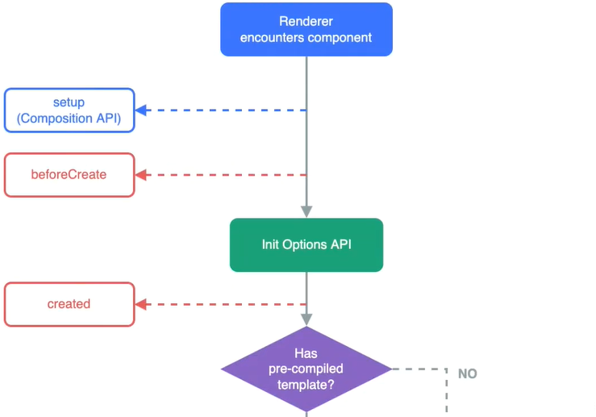

# 组合式`API`

原生`JS`获取`DOM`元素的方式在框架中不便使用，`vue2`提供了给元素/组件绑定`ref`属性的方式获取来对应的元素/组件。


##### `ref`获取元素

在`vue2`中通过组件实例的`$refs`属性来获取绑定了`ref`属性的元素；在`vue3`中则通过`ref`方法来获取，只需保持名称一致即可。

**注释**：由于`setup`早于`beforeCreate`执行，元素初始设为`null`，应在`mounted`之后再操作元素。

```html
<template>
	<div ref="wanzi"></div>
</template>

<script>
import {ref, onMounted, watchEffect} from "vue"
export default {
    setup () {
        let wanzi = ref(null); // 保证变量名与ref的值一致即可，初始为null。
        
        // 在元素挂载完成后，再打印元素，才会具有内容。【可批量操作】
        onMounted(() => {
            console.log(wanzi.value);
        })
        
        // 通过监听器监听某个元素【单元素操作】
        watchEffect(() => {
            if (wanzi.value) {
                console.log(wanzi.value);
            }
        })
        
        // 最后，一定要定义导出，否则也会获取不到元素。
        return {
            wanzi
        }
    }
}
</script>
```

<hr>

### 生命周期

在`vue2`中具有**4对**生命周期钩子函数：`create、mount、update、destroy`，其中`destroy`在`vue3`中更名为`unmount`。

**提示**：在各个组件`beforeUnmount`销毁之前，应清除或解绑所有的异步处理（如：定时器、侦听器等）或第三方的程序。

**注释**：在`setup`中，所有的生命周期钩子函数都必须带有`on`前缀且遵循驼峰命名，如：`onBeforeUnmount`。

由于`vue3`在`beforeCreate`之前引入了`setup`这个`API`，`beforeCreate`和`created`就显得不那么重要了。

并且，在`setup`中不需要使用`this`，因此`setup`中直接去除了`beforeCreate`和`created`这两个钩子函数。

​                                   

**提示**：如需使用`beforeCreate`和`created`钩子函数，可使用其选项式`API`。

```js
import {onBeforeMounted, onMounted, onBeforeUpdate, onUpdated, onBeforeUnmount, onUnmounted}
export default {
    beforeCreate () {},
    created () {},
    setup () {
        onBeforeMounted(() => {
            console.log("%c onBeforeMounted", "color: blue");
        })
        onMounted(() => {
            console.log("%c onMounted", "color: blue");
        }) 
        onBeforeUpdate(() => {
            console.log("%c onBeforeUpdate", "color: blue");
        }) 
        onUpdated(() => {
            console.log("%c onUpdated", "color: blue");
        }) 
        onBeforeUnmount(() => {
            console.log("%c onBeforeUnmount", "color: blue");
        }) 
        onUnmounted(() => {
            console.log("%c onUnmounted", "color: blue");
        })
    }
}
```

