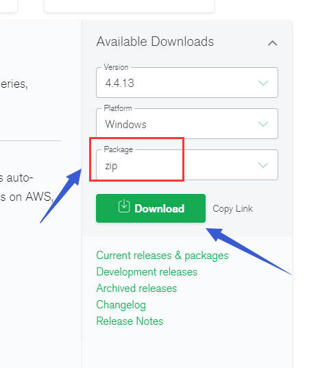
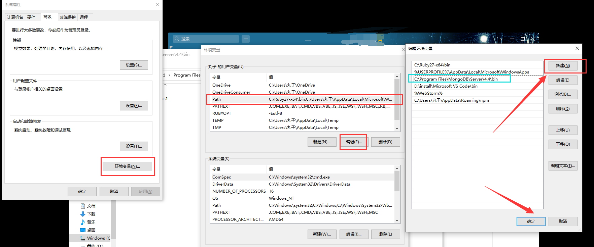
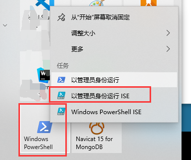
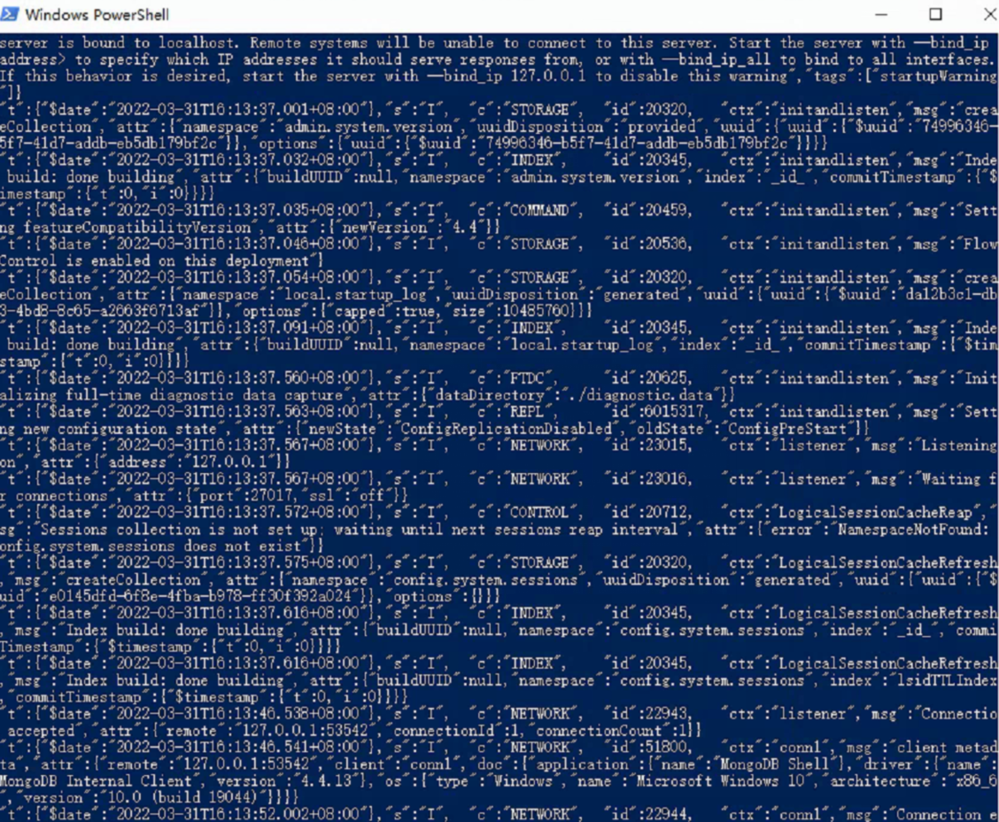

win11系统安装mongoDB出现下列报错时，可以按下面的步骤尝试解决：

**步骤**：

1. 下载免安装版本的mongoDB数据库

   

2. 在你系统盘的  `系统盘盘符:\Program Files` 路径下，新建  `MongoDB` 文件夹，将下载好的压缩包解压到该文件夹内

3. 解压后，找到该目录下的`Server\4.4\bin`文件夹，复制该路径，添加到环境变量中。

4. （按自己电脑的实际情况来） 假设我的`bin`目录路径为：`C:\Program Files\MongoDB\Server\4.4\bin`，将该路径添加到环境变量的`path`中：

   

5. 以管理员身份，运行命令行工具`powershell`

   

6. 输入命令：    `mongod.exe --nojournal --dbpath .`        回车后大概显示如下情况：

   （图是截图的学员电脑的，比较糊，能看到有东西出来就行，不要纠结！）

   

   在你需要连接数据库之前，先通过该命令启动数据库，该命令窗口在使用数据库期间不要关闭，关闭了数据库会停止连接。

7. 再另开`1`个命令行工具窗口，运行你的项目即可！