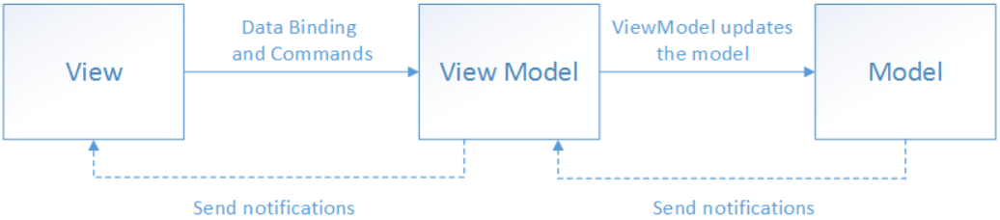

# `MVVM`

`MVVM` 是 `Model-View-ViewModel` 的简写。它本质上就是 [`MVC`](https://baike.baidu.com/item/MVC/85990?fromModule=lemma_inlink) 的改进版。`MVVM` 模式有助于将应用程序的业务和表示逻辑与用户界面（`UI`）清晰分离。 保持应用程序逻辑和 `UI` 之间的清晰分离有助于解决许多开发问题，并使应用程序更易于测试、维护和演变。 它还可以显著提高代码重用机会，并允许开发人员和 `UI` 设计人员在开发应用各自的部分时更轻松地进行协作。

`MVVM` 模式，应用的 `UI` 以及基础表示和业务逻辑被分成三个独立的类：视图，用于封装 `UI` 和 `UI` 逻辑；视图模型，用于封装表示逻辑和状态；以及模型，用于封装应用的业务逻辑和数据。


### 介绍

##### 发展

因为 `WPF` 技术出现，从而使 `MVC` 架构模式有所改进，`MVVM` 模式便是使用的是[数据绑定](https://baike.baidu.com/item/数据绑定?fromModule=lemma_inlink)基础架构。它们可以轻松构建 `UI` 的必要元素。可以参考 `The Composite Application Guidance for WPF(prism)`。

`View` 绑定到 `ViewModel`，然后执行一些命令在向它请求一个动作。而反过来，`ViewModel` 跟 `Model` 通讯，告诉它更新来响应 `UI`。这样便使得为应用构建 `UI` 非常的容易。往一个应用程序上贴一个界面越容易，外观设计师就越容易使用 `Blend` 来创建一个漂亮的界面。同时，当 `UI` 和功能越来越松耦合的时候，功能的可测试性就越来越强。

在 [`MVP` 模式](https://baike.baidu.com/item/MVP模式?fromModule=lemma_inlink) 中，为了让 `UI` 层能够从逻辑层上分离下来，设计师们在 `UI` 层与逻辑层之间加了一层 `interface`。无论是 `UI` 开发人员还是数据开发人员，都要尊重这个契约、按照它进行设计和开发。这样，理想状态下无论是 `Web UI` 还是 `Window UI` 就都可以使用同一套数据逻辑了。借鉴 `MVP` 的 `IView` 层，养成习惯。`View Model` 听起来比 `Presenter` 要贴切得多；会把一些跟事件、命令相关的东西放在 `MVC` 的 `'C'`，或者是 `MVVM` 的 `'VM'`。


​                      

##### 特点

`MVVM` 模式和 `MVC` 模式一样，主要目的是分离视图（`View`）和模型（`Model`），有几大优点：

**1. 低耦合**：视图（`View`）可以独立于 `Model` 变化和修改，一个 `ViewModel` 可以绑定到不同的 `"View"` 上，当 `View` 变化的时候 `Model` 可以不变，当 `Model` 变化的时候 `View` 也可以不变。

**2. 可重用性**：可以把一些视图逻辑放在一个 `ViewModel` 里面，让很多 `view` 重用这段视图逻辑。

**3. 独立开发**：开发人员可以专注于业务逻辑和数据的开发（`ViewModel`），设计人员可以专注于页面设计，使用 `Expression Blend` 可以很容易设计界面并生成 `xaml` 代码。

**4. 可测试**：界面素来是比较难于测试的，测试可以针对 `ViewModel` 来写。

使用 `MVVM` 来开发用户控件。由于用户控件在大部分情况下不涉及到数据的持久化，所以如果将M纯粹理解为 `DomainModel` 的话，使用 `MVVM` 模式来进行自定义**控件开发**实际上可以省略掉 `M`，变成了 `VVM`。

##### 组成

- 模型
  - 模型是指代表真实状态内容的[领域模型](https://baike.baidu.com/item/领域模型?fromModule=lemma_inlink)（面向对象），或指代表内容的[数据访问层](https://baike.baidu.com/item/数据访问层?fromModule=lemma_inlink)（以数据为中心）。
- 视图
  - 就像在 [`MVC`](https://baike.baidu.com/item/MVC?fromModule=lemma_inlink) 和 [`MVP`](https://baike.baidu.com/item/MVP?fromModule=lemma_inlink) 模式中一样，视图是用户在屏幕上看到的结构、布局和外观（`UI`）。
- 视图模型
  - *视图模型*是暴露公共属性和命令的视图的抽象。`MVVM` 没有 `MVC` 模式的控制器，也没有 `MVP` 模式的 `presenter`，有的是一个*绑定器*。在视图模型中，绑定器在视图和数据绑定器之间进行通信。
- 绑定器
  - 声明性数据和命令绑定隐含在 `MVVM` 模式中。在 `Microsoft` 解决方案堆中，绑定器是一种名为 [`XAML`](https://baike.baidu.com/item/XAML?fromModule=lemma_inlink) 的 [标记语言](https://baike.baidu.com/item/标记语言?fromModule=lemma_inlink)。绑定器使开发人员免于被迫编写样板式逻辑来同步视图模型和视图。在微软的堆之外实现时，声明性数据绑定技术的出现是实现该模式的一个关键因素。

##### 理论

`MVVM` 旨在利用 `WPF` 中的[数据绑定](https://baike.baidu.com/item/数据绑定?fromModule=lemma_inlink)函数，通过从视图层中几乎删除所有 [`GUI`](https://baike.baidu.com/item/GUI?fromModule=lemma_inlink) 代码（代码隐藏），更好地促进视图层开发与模式其余部分的分离。不需要[用户体验](https://baike.baidu.com/item/用户体验?fromModule=lemma_inlink)（`UX`）开发人员编写 `GUI` 代码，他们可以使用框架标记语言（如 [`XAML`](https://baike.baidu.com/item/XAML?fromModule=lemma_inlink)），并创建到应用程序开发人员编写和维护的视图模型的数据绑定。角色的分离使得[交互设计师](https://baike.baidu.com/item/交互设计师/3329267?fromModule=lemma_inlink)可以专注于用户体验需求，而不是对业务逻辑进行编程。这样，应用程序的层次可以在多个工作流中进行开发以提高生产力。即使一个开发人员在整个代码库上工作，视图与模型的适当分离也会更加高效，因为基于最终用户反馈，用户界面通常在开发周期中经常发生变化，而且处于开发周期后期。

`MVVM` 模式试图获得 `MVC` 提供的功能性开发分离的两个优点，同时利用[数据绑定](https://baike.baidu.com/item/数据绑定?fromModule=lemma_inlink)的优势和通过绑定数据的框架尽可能接近纯应用程序模型。它使用绑定器、视图模型和任何业务层的数据检查功能来验证传入的数据。结果是模型和框架驱动尽可能多的操作，消除或最小化直接操纵视图的应用程序逻辑（如代码隐藏）。


### 实现

#### 基本思想

例如，实现 `Vue` 的数据绑定。

```vue
<input type="text" v-model="age">
<p>{{age}}</p>

<script>
	let age = 16;
</script>
```

##### 简单实现

```html
<input type="text">
<p></p>
```

定义一个代理对象，用于对绑定数据进行代理（因为不建议直接对源数据进行操作）。

```js
let proxy = new Proxy({age: 16}, {
    get(target, key) {
        return Reflect.get(target, key);
    },
    set(target, key, value) {
        updateDom(value);
        return Reflect.set(target, key, value);
    }
});

let oInput = document.querySelector("input"),
    oP = document.querySelector("p");

function updateDom(value) {
    oInput.value = value;
    oP.innerHTML = value;
}

oInput.oninput = function() {
    proxy.age = this.value;
}

updateDom(proxy.age);
```

#### 数据绑定

例如，实现如下的 `Vue` 双向数据绑定语法。

```vue
<div id="app">
    {{name}} --- {{age}}
</div>
<script>
	Vue.createApp({
        data() {
            return {
                name: "wz",
            	age: 16
            }
        }
    }).mount("#app");
</script>
```

##### 语法识别

首先，定义一个初始化类，用于完成应用的初始化（包括容器的挂载以及数据初始化等）。

```js
// 可将其封装到 MVVM.js 文件中
(function () {
    // 应用初始化类
    class Init {
        constructor(options) {
            const data = options.data ? options.data() : {};
            this.$data = new Proxy(data, {
                get(target, key) {
                    return Reflect.get(target, key);
                },
                set(target, key, value) {
                    return Reflect.set(target, key, value);
                }
            });
        }
        mount(selector) {
            // 入口元素
            const root = document.querySelector(selector);
            // 容器内容
            const children = root.childNodes;
            children.forEach((node) => {
                if (node.nodeType === 3) {
                    let txt = node.nodeValue;
                    // 更新文本节点
                    txt = txt.replace(/\{\{(.+?)\}\}/g, ($0, $1) => { // 最小匹配
                        return this.$data[$1];
                    })
                    // 更新页面展示
                    node.nodeValue = txt;
                }
            })
        }
    }
    
    // 暴露到全局
    window.MVVM = {
        createApp(options) {
            return new Init(options);
        }
    }
})();
```

到这里，已经初步实现了能够识别 `{{}}` 语法。使用如下：

```html
<div id="app">
    姓名：{{name}} --- 年龄：{{age}}
</div>
<script src="./MVVM.js"></script>
<script>
    MVVM.createApp({
        data() {
            return {
                name: "wz",
                age: 16
            }
        }
    }).mount("#app");
</script>
```

##### 监听更新

下面，还要实现：当数据更新时更新视图。这里，要使用观察者模式。

```js
// MVVM.js
(function () {
    // 观察者（监听数据的更新，并及时更新视图）
    const OBSERVER = (function() {
        const DATA = {}; // 所有被监听的数据
        return {
            // 订阅（添加要监听的数据）
            on(key, callback) {
                if (!DATA[key]) DATA[key] = [];
                DATA[key].push(callback);
            },
            // 发布（数据更新时更新视图）
            emit(key, data) {
                if (!DATA[key]) return;
                DATA[key].forEach(cb => cb(data));
            }
        }
    })();

    // 记录所有依赖项
    const USEDKEY = (function() {
        let keyList = [],
            unused = true; // 所有要依赖的数据是否都未被使用过（这里指挂载）。
        return {
            isUnused() {
                return unused;
            },
            addKey(key) {
                return keyList.push(key);
            },
            getKeys() {
                return [...new Set(keyList)];
            },
            stop() {
                unused = false; // 当所有依赖项都被挂载完成之后，停止记录。
            },
            clearAll() {
                keyList = []; // 所有依赖项被加入观察者监听之后，清空记录。
            }
        }
    })();

    // 解析{{}}语法
    const complie_text = function(node, txt) {
        // 更新文本节点
        txt = txt.replace(/\{\{(.+?)\}\}/g, ($0, $1) => {
            return this.$data[$1];
        })
        // 更新页面展示
        node.nodeValue = txt;
    }

    // 应用初始化类
    class Init {
        constructor(options) {
            const data = options.data ? options.data() : {};
            this.$data = new Proxy(data, {
                get(target, key) {
                    // 将访问过的属性记录下来（只记录首次），以便监听
                    if (USEDKEY.isUnused()) USEDKEY.addKey(key);
                    return Reflect.get(target, key);
                },
                set(target, key, value) {
                    Reflect.set(target, key, value);
                    // 更新数据后，更新视图
                    return OBSERVER.emit(key); 
                }
            });
        }
        mount(selector) {
            // 入口元素
            const root = document.querySelector(selector);
            // 容器内容
            const children = root.childNodes;
            children.forEach(node => {
                if (node.nodeType === 3) {
                    const txt = node.nodeValue;
                    complie_text.call(this, node, txt);

                    let usedKeys = USEDKEY.getKeys();
                    // 订阅
                    usedKeys.forEach(key => {
                        OBSERVER.on(key, () => {
                            // 更新视图
                            complie_text.call(this, node, txt);
                        })
                    });
                    // 订阅完之后，清空记录。因为所有要依赖的数据都已经被添加进观察者之中了。
                    USEDKEY.clearAll();
                }
            })
            USEDKEY.stop();
            return this;
        }
    }

    // 暴露到全局
    window.MVVM = {
        createApp(options) {
            return new Init(options);
        }
    }
})();
```

##### 解析算式

通常，`{{}}` 中也可以使用一些简单的表达式。这里，只需要修改以下部分即可。

```js
// 解析{{}}中的表达式
const complie_exp = function(exp, data) {
    // 不安全的做法
    with(data) {
        return eval(exp);
    }
}

// 解析{{}}语法
const complie_text = function (node, txt) {
    // 更新文本节点
    txt = txt.replace(/\{\{(.+?)\}\}/g, ($0, $1) => {
        return complie_exp($1, this.$data);
    })
    // 更新页面展示
    node.nodeValue = txt;
}
```

##### 深度解析

在挂载阶段，只解析了入口元素的子节点。如果要解析其后代节点，则需要使用递归的形式进行深度解析。

首先，定义一个深度解析节点的函数，然后，将 `mount` 后的入口元素传入进行解析。

```js
// 深度解析节点
const complie_node_deeply = function(root) {
    const children = root.childNodes;
    children.forEach(node => {
        // 元素节点
        if(node.nodeType === 1) {
            complie_node_deeply.call(this, node);
        }
        // 文本节点
        if (node.nodeType === 3) {
            const txt = node.nodeValue;
            complie_text.call(this, node, txt);
            // 获取记录
            let usedKeys = USEDKEY.getKeys();
            // 添加订阅
            usedKeys.forEach(key => {
                OBSERVER.on(key, () => {
                    // 更新视图
                    complie_text.call(this, node, txt);
                })
            });
            // 订阅完之后，清空记录。因为所有要依赖的数据都已经被添加进观察者之中了。
            USEDKEY.clearAll();
        }
    })
}

// 应用初始化类
class Init {
	// ...
    mount(selector) {
        // 入口元素
        const root = document.querySelector(selector);
        // 深度解析
        complie_node_deeply.call(this, root);
        // 停止记录
        USEDKEY.stop();
        return this;
    }
}
```

接着，就可以在后代元素中使用 `{{}}` 语法了。

```html
<div id="app">
    <h4>个人简介</h4>
    <p>姓名：{{name}}</p>
    <p>年龄：{{age * 2}}</p>
</div>
```

##### 指令属性

在元素节点上，可以使用一些指令属性来动态绑定数据。

```js
// 解析指令属性
const complie_attrs = function(node, attrName, attrValue) {
    // m-bind: 或 : 指令
    if (/^m-bind:(.+)$/.test(attrName) || /^:(.+)$/.test(attrName)) {
        const attr = RegExp.$1,
              value = complie_exp(attrValue, this.$data);

        if(attr === "class" || attr === "classname") {
            return node.classList.add(value);
        }
        if(attr === "style") {
            return node.style.cssText += value;
        }
        // 除了class和style之外，原先的同名属性都会被覆盖。
        node.setAttribute(attr, value);
    }
}

// 添加订阅
const subscribe = function(cb) {
    // 获取记录
    const usedKeys = USEDKEY.getKeys();
    // 添加订阅
    usedKeys.forEach(key => {
        OBSERVER.on(key, cb);
    });
    // 订阅完之后，清空记录。因为所有要依赖的数据都已经被添加进观察者之中了。
    USEDKEY.clearAll();
}

// 深度解析节点
const complie_node_deeply = function (root) {
    const children = root.childNodes;
    children.forEach(node => {
        // 元素节点
        if (node.nodeType === 1) {
            complie_node_deeply.call(this, node);

            // 属性节点
            const attrs = node.attributes;
            if(attrs.length > 0) {
                [...attrs].forEach(({nodeName, nodeValue}) => {
                    complie_attrs.call(this, node, nodeName, nodeValue);
                    // 添加订阅
                    subscribe(() => {
                        // 更新标签属性中，动态绑定的数据
                        complie_attrs.call(this, node, nodeName, nodeValue);
                    });
                })
            }
        }
        // 文本节点
        if (node.nodeType === 3) {
            const txt = node.nodeValue;
            complie_text.call(this, node, txt);
            // 添加订阅
            subscribe(() => {
                // 更新视图
                complie_text.call(this, node, txt);
            });
        }
    })
}
```

然后，可以使用 `v-bind` 指令在元素上绑定动态属性了。

```html
<div id="app">
    <h4 class="wz" m-bind:className="className" style="padding: 0;" m-bind:style="style">个人简介</h4>
    <p>姓名：{{name}}</p>
    <p age="10" :age="age">年龄：{{age * 2}}</p>
</div>

<script src="./MVVM.js"></script>
<script>
    const vm = MVVM.createApp({
        data() {
            return {
                name: "wz",
                age: 16,
                className: "className",
                style: "color: red"
            }
        }
    }).mount("#app");
</script>
```

如果要支持 `style` 使用对象的话，则修改以下代码即可。

```js
// 解析指令属性
const complie_attrs = function (node, attrName, attrValue) {
    // m-bind: 或 : 指令
    if (/^m-bind:(.+)$/.test(attrName) || /^:(.+)$/.test(attrName)) {
        const attr = RegExp.$1,
              value = complie_exp(attrValue, this.$data);

        if (attr === "class" || attr === "classname") {
            return node.classList.add(value);
        }
        if (attr === "style") {
            let cssText = value || "";
            if(typeof value === "object") {
                cssText = Object.entries(cssText);
                cssText = cssText.map(item => item.join(": ")).join("; ");
            }
            return node.style.cssText += cssText;
        }
        // 除了class和style之外，原先的同名属性都会被覆盖。
        node.setAttribute(attr, value);
    }
}
```

只支持使用 `css` 键值对定义的 `style` 对象。

```js
{
	"color": "red",
 	"font-size": "14px"
}
```

##### 双向绑定

实现 `v-model` 的双向数据绑定。

```js
// 解析指令属性
const complie_attrs = function (node, attrName, attrValue) {
    // ...
    
    // m-model
    if (/^m-model$/.test(attrName)) {
        const value = complie_exp(attrValue, this.$data),
              type = node.type;
        // 根据不同的控件类型，执行不同的操作
        // 文本框
        if (type === "text" || type === "textarea") {
            node.value = value;
            // 挂载之前，添加事件
            USEDKEY.isUnused() && node.addEventListener("input", () => {
                this.$data[attrValue] = node.value;
            });
        }
        // 单选框
        if (type === "radio") {
            node.checked = node.value === value;
            // 挂载之前，添加事件
            USEDKEY.isUnused() && node.addEventListener("change", () => {
                this.$data[attrValue] = node.value;
            });
        }
        // 多选框
        if(type === "checkbox") {
            node.checked = value.includes(node.value);
            USEDKEY.isUnused() && node.addEventListener("change", () => {
                if(node.checked) {
                    // 勾选
                    this.$data[attrValue] = [...this.$data[attrValue], node.value];
                } else {
                    // 取消勾选
                    const arr = this.$data[attrValue],
                          index = arr.indexOf(node.value);
                    if(index !== -1) arr.splice(index, 1);
                    this.$data[attrValue] = arr;
                }
            });
        }
        // 单选菜单
        if(type === "select-one") {
            node.value = value;
            // 挂载之前，添加事件
            USEDKEY.isUnused() && node.addEventListener("change", () => {
                this.$data[attrValue] = node.value;
            });
        }
        // 多选菜单
        if (type === "select-multiple") {
            [...node].forEach(option => {
                option.selected = value.includes(option.value);
            })
            // 挂载之前，添加事件
            USEDKEY.isUnused() && node.addEventListener("change", () => {
                let arr = [];
                [...node].forEach(option => {
                    if(option.selected) arr.push(option.value);
                });
                this.$data[attrValue] = arr;
            });
        }
    }
}
```

使用如下：

```html
<div id="app">
    <div>
        <h4>姓名：{{name}}</h4>
        <p>输入姓名：<input type="text" m-model="name" /></p>
    </div>
    <div>
        <p>性别：{{sex}}</p>
        <p>
            选择性别：
            <input type="radio" name="sex" value="男" m-model="sex">男
            <input type="radio" name="sex" value="女" m-model="sex">女
        </p>
    </div>
    <div>
        <p>运动：{{sports}}</p>
        <p>锻炼方式：
            <input type="checkbox" value="跳舞" m-model="sports">跳舞
            <input type="checkbox" value="游泳" m-model="sports">游泳
            <input type="checkbox" value="篮球" m-model="sports">篮球
            <input type="checkbox" value="跑步" m-model="sports">跑步
        </p>
    </div>
    <div>
        <p>星期：{{weak}}</p>
        <select m-model="weak">
            <option value="1">星期一</option>
            <option value="2">星期二</option>
            <option value="3">星期三</option>
            <option value="4">星期四</option>
            <option value="5">星期五</option>
            <option value="6">星期六</option>
            <option value="0">星期天</option>
        </select>
    </div>
    <div>
        <p>朋友：{{friends}}</p>
        <select m-model="friends" multiple>
            <option value="王">王</option>
            <option value="李">李</option>
            <option value="张">张</option>
            <option value="刘">刘</option>
            <option value="陈">陈</option>
        </select>
    </div>
    <div>
        <input type="textarea" m-model="desc" />
        <p>自我介绍：{{desc}}</p>
    </div>
</div>

<script src="./MVVM.js"></script>
<script>
    const vm = MVVM.createApp({
        data() {
            return {
                name: "wz",
                desc: "自我介绍",
                sex: "女",
                sports: ["跳舞", "篮球"],
                weak: "1",
                friends: ["王", "刘"]
            }
        }
    }).mount("#app");
</script>
```

##### 条件判断

实现条件判断的功能

```js
// 解析指令属性
const complie_attrs = function (node, attrName, attrValue) {
 	// ...
    
    // m-show
    if (/^m-show$/.test(attrName)) {
        const value = complie_exp(attrValue, this.$data);
        node.style.display = value ? "" : "none";
    }
}
```

使用

```html
<div id="app">
    <div m-show="bool">是否显示</div>
</div>

<script src="./MVVM.js"></script>
<script>
    const vm = MVVM.createApp({
        data() {
            return {
                bool: true
            }
        }
    }).mount("#app");

    document.onclick = function() {
        vm.$data.bool = !vm.$data.bool;
    }
</script>
```


